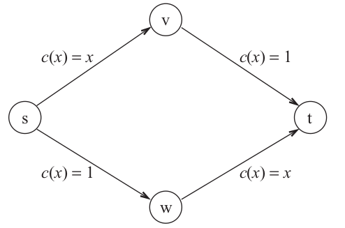

Algorithmic Game Theory
=======================

**\[INTRODUZIONE DISCORSIVA SU Algorithmic Game Theory: DA FARE...\]**

Games and Equilibrium
=====================

La *Teoria dei Giochi* consente di modellare situazioni in cui
molteplici partecipanti interagiscono tra di loro e le loro azioni sono
influenzate da ciò che fanno gli altri. Consideriamo alcuni esempi, in
cui ogni individuo (o **player**) sceglie simultaneamente agli altri
un\'azione da un\'insieme di possibili **strategie**.

### Esempio 1: Prisoner\'s Dilemma

Due criminali sono incolpati di due crimini, uno meno grave del quale se
ne hanno le prove, e uno molto grave del quale però c\'è solo il
sospetto. La pena per il reato meno grave è di 2 anni, mentre la pena
per quello grave è di 5 anni. I due criminali vengono separati ed
interrogati. In questa maniera non possono mettersi d\'accordo sulla
versione dei fatti. Ai due criminali viene proposto un accordo: chi
confessa che l\'altro complice è responsabile del reato più grave,
riceverà una riduzione della pena di 1 anno. In base a tutte le
possibili **strategie** che i due criminali possono adottare, è
possibile modellare il *guadagno* che ne ricavano con una tabella, che
chiameremo **matrice dei costi**.

{style="max-width:300px; width:100%"}

Dato che i due non possono in alcun modo mettersi d\'accordo su cosa
fare, allora un buon approccio è quello di considerare tutte le
situazioni possibili, ovvero la situazione in cui il complice confessa e
la stiuazione in cui non confessa.\
Supponiamo di essere il \"giocatore\" (o criminale) `P1`. Se il nostro
complice `P2` dovesse confessare, la strategia che ci consente di
attenuare la nostra pena sarebbe quella di confessare a nostra volta.
Infatti, non confessare ci farebbe fare il massimo della pensa, 5 anni.
Viceversa, se confessassimo avremmo uno sconto di 1 anno, per un totale
di 4 anni.\
Se invece il nostro complice `P2` decidesse di essere fedele e di non
parlare, in ogni caso ci converrebbe confessare la sua colpevolezza
(trandendolo). Infatti, se non confessiamo, entrambi otteremmo una pena
di 2 anni. Possiamo però abbassare la nostra pena ad 1 solo anno
confessando la colpevolezza di `P2`, che poveraccio dovrà farsi 5 anni
di carcere.\
Osservare che la situazione migliore in generale è quella in cui nessuno
confessa. Dato che però `P1` non può dare per scontata la fedeltà di
`P2`, è ragionevole pensare che l\'unica situazione di **stabilità**
possibile è quando entrambi confessano. Infatti, qual\'ora un giocatore
non confessasse, potrebbe comunque migliorare la sua situazione
confessando, riducendo la propria pena di un anno.\
In questi tipi di casi, ovvero quando una strategia migliora sempre la
propria situazione personale indipendentemente dalle azioni degli altri,
si dice che tale strategia è una **strategia dominante**.

### Esempio 2: ISP[^1] Routing Game

In questo gioco ci sono due *Internet Service Providers* che devono
decidere dove redirigere il flusso di informazioni, da una srogente $s$
ad una destinazione $t$. Per ogni messaggio che passa lungo le proprie
connessioni, l\'`ISP` in questione pagherà un costo simbolico di 1.
Esistono due nodi di confine tra i due `ISP`, i nodi $C$ ed $S$. Ogni
player (`ISP1` e `ISP2`) deve decidere se mandare il flusso attraverso
$C$ (e quindi far pagare parte del traggitto all\'ISP avversario),
oppure attraverso il nodo $S$, e pagare tutto l\'intero tragitto.\
L\'immagine successiva rappresenta la stiuazione appena descritta

{style="max-width:300px; width:100%"}

In questo caso la *matrice dei costi* è esattamente quella del dilemma
dei prigionieri

{style="max-width:300px; width:100%"}

perciò anche in questo caso confiene a entrambi i player essere
\"scorretti\" ed \"egoisti\", trasmettendo verso il nodo $C$.

Definizione di Strategia
------------------------

Più formalmente, in ogni *gioco* esiste un insieme di $n$ **giocatori**
(o **player**) $\lbrace 1, 2, ..., n \rbrace$. Ogni giocatore $i$ ha un
suo **insieme di strategie possibili** $S_i$. Per giocare, ogni
giocatore $i$ deve scegliere una strategia tra le sue possibili
$s_i \in S_i$. Indichiamo con $$
   s = (s_1, s_2, ..., s_n) \in S \equiv S_1 \times S_2 \times ... \times S_n
   $$ il **vettore delle strategie** o **combinazione di strategie**
scelte da tutti gli $n$ giocatori.\
Ogni vettore di strategie $s \in S$ definisce anche una **ricompensa**
(o **payoff**) per ogni player che ne descrive il guadagno che ne
ottiene in seguito alle strategie applicate in $s$. Più precisamente

```{=latex}
\begin{align*}
     &p_1 : S \rightarrow \mathbb{R}\\
     &p_2 : S \rightarrow \mathbb{R}\\
     &\vdots\\
     &p_n : S \rightarrow \mathbb{R}
\end{align*}
```
dove $p_i(s)$ è il guadagno che ricava il giocatore $i$ dall\'insieme di
strategie $s \in S$.\
Ovviamente si sta assumendo che tale gioco prevede solo dei \"premi\"
(payoffs) da voler massimizzare, ma in realtà potrebbero capitare giochi
in cui si vuole **minimizzare** una perdita. In tal caso la notazione è
la medemisa, con la differenza che $p_i(s_1) \geq p_i(s_2)$ può star ad
indicare che $s_1$ è migliore o peggiore rispetto a $s_2$ per il player
$i$, in base al contesto in cui ci si trova.\

Dominating Strategy
-------------------

Una strategia $s_i^* \in S_i$ è una **strategia dominante** per un
player $i$ se $s_i$ è la scelta migliore che $i$ può fare
indipendentemente da quello che scelgono di fare gli altri player. Più
formalmente sia un *vettore di strategie* $s \in S$, definiamo con
$s_{-i}$ il vettore $(n-1)$-dimensionale contenente tutte le strategie
dei giocatori eccetto $i$, ovvero $$
   s_{-i} = (s_1, s_2, ..., s_{i-1}, s_{i+1}, ..., s_n)
   $$ La strategia $s_i^*$ è dominante per $i$ se presa un\'altra
qualsiasi strategia $s_i \in S_i$ vale che $$
   p_i(s_i^*, s_{-i}) \geq p_i(s_i, s_{-i})
   $$ minore o uguale se consideriamo problemi di minimizzazione.\

Dominating Strategy Equilibrium
-------------------------------

Una **combinazione di strategie** $s^* = (s_1^*, s_2^*, ..., s_n^*)$ è
una **Dominating Strategy Equilibrium** (`DSE`) se per ogni $i$, $s_i^*$
è una strategia dominante, ovvero se $\forall s \in S$ $$
   p_i(s_i^*, s_{-i}) \geq p_i(s_i, s_{-i})
   $$ Avere una strategia dominante per ogni singolo player è un
requisito troppo stringente, infatti i giochi che accettano un `DSE`
sono davvero rari. Per questo motivo necessitiamo di trovare una
condizione meno stringente, che può essere quindi applicata su una
grande vastità di giochi.

Nash Equilibrium in Strategie Pure
----------------------------------

Un **Equilibrio di Nash** (o **Nash Equilibrium**) **in strategie pure**
è una strategia $s \in S$ nella qualle a nessun player conviene cambiare
strategia personale. Più formalmente $s$ è un `NE`[^2] se, data
un\'altra generica strategia $s' \in S$, è vero che per ogni player $i$
$$
   p_i(s_i, s_{-i}) \geq p_i(s_i', s_{-i})
   $$ ovvero al player $i$ scegleire $s_i'$ non migliora la situazione
rispetto ad $s_i$.\
La differenza col `DSE`, e che in un `NE` ad ogni nodo non conviene
cambiare strategie [dipendentemente]{.underline} dalle strategia scelte
dagli altri. In un `DSE` invece ad ogni player non conviene mai cambiare
strategia, [indipendentemente]{.underline} dalle strategie degli altri.\

### Esempio 3: Battle of sexes

Consideriamo un gioco in cui due giocatori, un `ragazzo` (`Boy`) e una
`ragazza` (`Girl`), devono decidere come trascorrere la serata. Le due
possibilità sono: andare a una `partita di calcio` o al `cinema`. Il
ragazzo preferisce il calcio (opzione `B`) e la ragazza preferisce
cinema (opzione `S`), ma entrambi vorrebbero trascorrere la serata
insieme piuttosto che separatamente. Esprimiamo nuovamente le preferenze
dei giocatori tramite payoff (benefici) come segue

{style="max-width:300px; width:100%"}

Le due situazioni in cui entrambi i giocatori scelgono le stesse
strategie sono delle **situazioni stabili**. Inoltre a nessuno dei due
conviene cambiare strategia, perciò le combinazioni di strategie $(B,B)$
e $(S,S)$ sono entrambi **equilibri di Nash**.\
Notare infine che non ci sono **strategie dominanti**, perché al player
`Boy` conviene scegleire $B$ se `Girl` sceglie $B$, ed $S$ se `Girl`
sceglie $S$. In una strategia dominante invece, ci dovrebbe essere una
scelta sempre migliore per `Boy`, indipendentemente da ciò che scelgie
`Girl`.

### Esempio 4: Routing Congestion Game

Supponiamo che il *proxy* `O` sia la sorgente di due flussi di dati che
devono essere instradati nel resto della rete. Supponiamo inoltre che il
nodo `O` sia connesso al resto della rete tramite gli *access point* `A`
e `B`, dove `A` è un po\' più vicino ad `O` rispetto a `B`. Tuttavia,
entrambi gli *access point* vengono facilmente congestionati, quindi
inviare tutto il flusso attraverso uno solo di questi creerebbe un
ritardo eccessivo.\
Più precisamente, quando si instrada un solo messaggio attraverso `A` si
paga un\'attesa di 1, mentre attraverso `B` un\'attesa di 2. Invece, se
si instradano due messaggi attraverso `A` si paga un\'attesa di 5,
mentre attraverso `B` un\'attesa di 6.

{style="max-width:500px; width:100%"}

Possiamo modellare questa situazione come un gioco in cui i due
giocatori sono i *flussi* che devono raggiungere la rete, i quali
vogliono [minimizzare]{.underline} il tempo trasmissione. Intuitivamente
buoni risultati complessivi si ottengono quando i due flussi si
coordinano, attraversando due *accesso point* differenti.\
In questo caso le due uniche combinazioni di strategie di equilibrio
(`(A,B)` e `(B,A)`) sono anche degli *equilibri di Nash*. Infatti, in
tali situazioni, a nessun player conviene cambiare strategia, inoltre
non esiste una *strategia dominante* che conviene sempre adottare
indipendentemente da ciò che fa l\'altro player.

### Esempio 5: Matching Pennies Game

Guardiamo ora un esempio di gioco in cui non esiste alcuna situazione di
equilibrio.\
Ci sono due giocatori, ciascuno con una moneta, a quali viene chiesto di
scegliere tra due strategie: testa `H` e croce `T`. Il giocatore `1`
vince se i due centesimi corrispondono, mentre il giocatore `2` vince se
non corrispondono, come mostrato dalla seguente matrice dei guadagni,
dove il valore 1 indica la vittoria e -1 indica la sconfitta.

{style="max-width:300px; width:100%"}

È facile vedere che questo gioco non ha alcuna *soluzione stabile*, e
quindi alcun tipo di equilibrio.

Mixed Strategy Nash Equilibria
------------------------------

Gli equilibri di Nash considerato finora sono chiamati **equilibri a
strategia pura**, poiché ogni giocatore gioca
[deterministicamente]{.underline} la sua strategia. Come illustrato dal
gioco precedente gioco *Matching Pennies*, esistono giochi che non hanno
`NE` a strategia pura. Tuttavia, se nel gioco *Matching Pennies*, ai
giocatori è permesso scegliere uns sua strategie totalmente a caso (in
questo caso con probabilità $1/2$), allora si può ottenere una soluzione
stabile. Il motivo è che il payoff **atteso** (o **medio**[^3]) di ogni
giocatore ora è 0, e nessuno dei due giocatori può migliorarlo
scegliendo una distribuzione differente.\
In tale proposito, esiste la nozione di **Equilibrio di Nash a Strategie
Miste** (**Mixed Strategy Nash Equilibrium**). Per tale definizione si
assume che giocatori siano **neutrali al rischio**, cioè che agiscono
solamente per massimizzare il **payoff atteso**. Assumiamo inoltre che i
giocatori possano definire una **distribuzione** sull\'insieme delle
loro strategie: per questo diremo che i giocatori adottano **strategie
miste**. Infine supponiamo che i giocatori scelgano le strategie in modo
[totalmente indipendente]{.underline} dagli altri.\

> **Def** /(Mixed Strategy Nash Equilibrium)/\
> Un **Equilibrio di Nash a Strategie Miste** è un equilibrio in cui
> nessun giocatore migliora il suo [guadagno atteso]{.underline}
> cambiando distribuzione di strategie.

Le scelte [casuali e indipendenti]{.underline} dei giocatori portano a
loro volta a una distribuzione di probabilità dei vettori di strategia
$s$. Nash nel 1951 ha dimostrato che sotto queste assunzioni, ogni gioco
con un numero finito di giocatori, ciascuno con un insieme finito di
strategie, ha un equilibrio di Nash a strategie miste.

> **THM** /(Nash 1951)/\
> Any game with a finite set of players and finite set of strategies has
> a Nash equilibrium of mixed strategies.

Quality of Nash Equilibrium
===========================

Richiamando l\'esempio del *Prisoner\'s Dilemma* osserviamo che l\'unico
equilibrio conduce alla situazione in cui entrambi i prigionieri fanno 4
anni di carcere. Ciò che ci si chiede è: questo **risultato**
(**outcome**) è **socialmente accettabile**? Per rispondere alla domanda
bisogna dare una definizione formale di *socialmente accettabile*.
Innanzitutto bisogna definire una **funzione di scelta sociale** che in
qualche modo quantifica il risultato di un profilo di strategie $s$. Per
esempio è ragionevole considerare la funzione
$C : S \rightarrow \mathbb{R}$ che è pari alla *somma di tutti i
payoffs*, (oppure alla somma di tutti i costi). $$
  c(s) = \sum_{i = 1}^{n} p_i(s)
  $$ Ovviamente si desidera [minimizzare]{.underline} $c(s)$ qual\'ora
si considerano i costi, e [massimizzare]{.underline} nel caso in cui si
considerano i guadagni.\
Definita ora una misura di costo sociale, è facile notare che
nell\'esempio del *Prisoner\'s Dilemma* l\'unico equilibrio **non** è
socialmente accettabile, in quanto il costo minimo (in termini di anni
di carcare) si ha quando entrambi non confessano. Infatti, nel caso di
equilibrio il costo sociale è di 8, mentre il caso ottimo è 4.\
Possiamo quindi intuire che gli equilibri di Nash non comportano
necessariamente un costo sociale ottimo, e che viceversa, una situazione
socialmente ottima non è necessariamente un equilibrio di Nash.

The Price of Anarchy and the Price of Stability
-----------------------------------------------

Il **prezzo dell\'anarchia** (in breve `PoA`) di un gioco è una delle
misure più importanti per quantificare l\'infficienza di un equilibrio.
Sia `NEs` l\'insieme di tutti gli equilibri di Nash e sia `OPT` il
profilo di strategie ottimo per un gioco. Se siamo nel caso in cui
l\'obiettivo è **minimizzare** un costo, allora possiamo definire il
prezzo dell\'anarchia inerente alla funzione costo $C$ come la quantità
$$
   PoA(C) = \max_{s \in NEs}{\frac{C(s)}{C(OPT)}}
   $$ Se invece si vuole massimizzare il guadagno, il prezzo
dell\'anarchia è pari a $$
   PoA(C) = \min_{s \in NEs}{\frac{C(s)}{C(OPT)}}
   $$ In generale `PoA` è pari al rapporto tra il costo dell\'equilibrio
di Nash peggiore e il costo del profilo di strategia ottimo.\
Analogamente possiamo definire il **prezzo della stabilità** (in breve
`PoS`) come il rapporto tra il costo del miglior equilibrio di Nashe e
il costo del profilo di strategia ottimo. Nel caso di *minimizzazione
dei costi* sarà $$
   PoS(C) = \min_{s \in NEs}{\frac{C(s)}{C(OPT)}}
   $$ mentre nel caso di *massimizzazione dei profitti* $$
   PoS(C) = \max_{s \in NEs}{\frac{C(s)}{C(OPT)}}
   $$

### Esempio 6: Pigou\'s Game

Consideriamo un gioco in cui abbiamo $n$ quantità di flusso di dati, i
quali devono scegliere quale connessione utilizzare. Ogni flusso $i$
consuma una frazione di banda $1/n$ uguale agli altri. Ogni giocatore
può scegliere se far passare il suo flusso attraverso due possibili
connessioni:

-   attraverso la prima si paga una latenza pari a $c(x) = 1$, dove $x$
    indica la frazione di altri player che hanno scelto la stessa
    opzione.
-   attravero la seconda invece si paga una latenza pari a $c(x) = x$,
    dove ancora $x$ indica la frazione di altri player che hanno scelto
    la stessa opzione.

Ogni giocatore vuole minimizzare la propria latenza.\

{style="max-width:400px; width:100%"}

Intuitivamente, l\'unico equilibrio di Nash è quello in cui tutti i
player scelgono la seconda opzione pagando $c(x) = x$. In tal caso il
costo sociale sarà 1. Invece, la situazione ottima è quella in cui la
metà dei nodi scelgie un\'opzione e l\'altra metà sceglie l\'altra.
Infatti $$
    C(OPT) = \frac{1}{2}\frac{1}{2} + \frac{1}{2}1 = \frac{3}{4}
    $$

Perciò in questo avremo che `PoA` e `PoS` valgono entrambi
$\frac{3/4}{1} = \frac{4}{3}$.

### The Braess's paradox

Consideriamo un gioco simile al precedente in cui ogni giocatore vuole
redirigere la propria unità di traffico in modo da minimizzare la
propria la tenza. Tale gioco è descritto dalla seguente immagine

{style="max-width:400px; width:100%"}

In questo gioco la situazione [ottima]{.underline} è quella in cui metà
del flusso passa per la strata $(s,w,t)$ e l\'altra metà per $(s,v,t)$.
In questa maniera, ogni nodo paga esattamente una latenza di 1.5.
Osservare che 1.5 è anche il costo di tale soluzione ottima. Inoltre
possiamo pure affermare che questa è un equilibrio di Nash, in quanto a
nessun giocatore conviene cambiare strategia.\
È facile convincersi che questo è l\'uncio equilibrio possibile. Perciò
avremo che `PoA` e `PoS` saranno pari ad 1.\
Immaginiamo ora di migliorare la rete, aggiungendo l\'arco $v,w$ di
costo 0.

{style="max-width:400px; width:100%"}

Anche in questo caso, la situazione ottima rimane uguale a quella
precedente. Però adesso esiste un\'alta strategia di equilibrio, quella
in cui ogni player sceglie la strada $s,v,w,t$. In questa strategia, a
nessun individuo conviene cambiare strada, però purtroppo ha un costo in
termini di latenza di 2.\
Abbiamo quindi individuato due situazioni di equilibrio, una ottima con
costo $3/2$, ed una peggiore di costo 2. Perciò, avremo che il **costo
dell\'anarchia** in questa nuova rete *migliorata*, è in realtà
[peggiore]{.underline} del precedente. Infatti `PoA` sarà
$\frac{2}{3/2} = \frac{4}{3}$.

------------------------------------------------------------------------

[^1]: *Internet Service Provider*

[^2]: *Nash Equilibrium*

[^3]: vedi [valore atteso](https://it.wikipedia.org/wiki/Valore_atteso).
