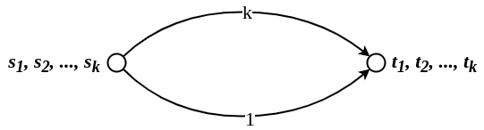

Network Formation Games
=======================

I *Network Formation Games* (in breve `NFG`) sono dei giochi che
modellano come un insieme di *player egoistici* costruiscono una rete.
Questi giochi possono essere usati nel mondo reale per modellare i
fenomeni che generano le reti sociali dei social-network, oppure una
rete P2P dinamica.\
L\'obbiettivo dei partecipanti al gioco è sostanzialmente quello di:

-   **minimizzare** il costo di costruizione della propria porzione di
    rete.
-   **massimizzare** la qualità dei servizi che la rete riesce ad
    offrire ai nodi.

Vedremo due tipologie di giochi che risolvono questo problema:

-   i **Global Connection Games**
-   i **Local Connection Games**

Useremo gli equilibri di Nash come qualità che garantiscono la stabilità
della rete, e inoltre misureremo il costo sociale come la somma di tutte
le spese fatte dai singoli giocatori.

Global Connection Game
======================

In questo gioco abbiamo un grafo diretto $G(V,E)$ con dei costi $c_e$
non negativi per ogni arco $e \in E$. Ci sono $k$ giocatori, e ad ogni
giocatore $i$ è associata una coppia di nodi $(s_i,t_i)$ di nodi
sorgente e destinazione. L\'obiettivo del giocatore $i$-esimo è quello
di ottenere una rete in cui la destinazione $t_i$ è raggiungibile da
$s_i$, pagando il meno possibile il proprio costo di costruzione. In
altri termini, la strategia del giocatore $i$ è un percorso $P_i$ da
$s_i$ a $t_i$, in $G$.\
Date quindi tutte le strategie dei partecipanti
$S = (P_1, P_2, ..., P_k)$, definiamo la rete risultante come $$
  NET(S) = \bigcup_{i=1}^{k} P_i
  $$ Dato che un arco $e$ può essere utilizzato da più di un player,
indichiamo con $k_e(S)$ il numero di player che usano l\'arco $e$ nella
loro strategia $P_i \in S$, ovvero $$
  k_e(S) = \vert \lbrace P_i \in S : e \in P_i \rbrace \vert
  $$

A questo punto possiamo definire il costo del signolo player $i$ come la
quantità $$
  COST_i(S) = \sum_{e \in P_i} \frac{c_e}{k_e(S)}
  $$ Alcune volte ci riferiremo a $k_e(S)$ semplicemente con $k_e$.\
Questa unità di costo dei singoli player è nota come **Shapley
cost-sharing mechanism**, o semplicemente **fair mechanism**. Il costo
sociale della configurazione di strategie $S$ sarà quindi la somma di
tutti costi simboli $$
  COST(S) = \sum_{i = 1}^{k} COST_i(S)
  $$

Infine consideriamo un equilibrio di Nash `NE` come *soluzione* del
problema. Inoltre una rete è considerata *ottima* o *socialmente ottima*
se [minimizza]{.underline} il costo costo sociale $COST(S)$.\
Consideriamo la seguente rete in figura. È facile verificare che quella
composta dagli archi rossi è la rete con *social cost* minimo.

{style="max-width:450px; width:100%"}

Purtroppo però questa non è una rete stabile, in quanto il `Player1` può
decidere di cambiare strategia ed abbassare il suo costo complessivo da
7 a 6.

{style="max-width:450px; width:100%"}

La rete risultate non è ancora stabile, e inoltre il costo del `Player2`
è aumentato da 6 a 1. Perciò anche `Player2` decide di cambiare
strategia, abbassando il suo costo a 10.

{style="max-width:450px; width:100%"}

A questo punto la rete risulta stabile, con un costo sociale di 16,
maggiore di quello ottimo.\
Alcune domande che ci possiamo porre in merito a questo gioco sono:

1.  Esiste sempre una rete stabile per ogni istanza di gioco?
2.  Possiamo dare un bound al prezzo dell\'anarchia `PoA` e al prezzo
    della stabilità `PoS`?
3.  Se eseguiamo il gioco in maniera iterativa, è sempre possibile
    convergere ad un equilibrio, qualsiasi sia la configurazione
    iniziale?

Price of Anarchy
----------------

Consideriamo il gioco nella seguente figura

{style="max-width:450px; width:100%"}

Certamente la soluzione ottima è quella in cui tutti scelgono l\'arco di
costo 1, con un costo sociale complessivo di 1. Questo è anche una
situazione di equilibrio, in cui a nessuno conviene cambiare strategia,
perciò possiamo dire anche che il prezzo della stabilità `PoS` è 1.\
Un\'altra situazione di equilibrio è quella in cui tutti scelgono
l\'arco di costo $k$. In tal caso, ognuno pagherà 1, e anche cambiando
arco il costo non migliora. Tale situazione è la peggiore situazione di
equilibrio, perciò il costo dell\'anarchia `PoA` sarà pari a $k$.\
Trovata quindi un\'istanza in cui `PoA` è $k$, possiamo dare come
*lowerbound* generale a `PoA` $k$. Il seguente teorema ci dice (e
dimostra) che $k$ è anche un upperbound alla `PoA`.\

> **THM** The `PoA` in the global connection game with $k$ players is
> **at most** $k$.

> **Proof** Sia $S \in NEs$ una soluzione generica del problema, ovvero
> un `NE`, e sia $S^*$ una soluzione ottima che minimizza il costo
> sociale. Per ogni player $i$, indichiamo con $\pi_i$ un **cammino
> minimo** in $G$ tra $s_i$ e $t_i$.
>
> Sicuramente $COST_i(S) \leq COST_i(S_{-i}, \pi_i)$, in quanto per
> definizione $S$ è un equilibrio di Nash, perciò a nessuno conviene
> cambiare strategie (tantomeno ad $i$).\
> Inoltre per definizione abbiamo che
>
> ```{=latex}
> \begin{align*}
>   COST_i(S_{-i}, \pi_i) = \sum_{e \in \pi_i} \frac{c_e}{k_e} \leq \sum_{e \in \pi_i} c_e = d_G(s_i, t_i)
> \end{align*}
> ```
> Osserviamo ora che il costo sociale di una qualsiasi soluzione è pari
> alla somma del costo di tutti gli archi che lo compongono $$
> COST(S^*) = \sum_{i=1}^{k} COST_i(S^*) = \sum_{i=1}^{k} \sum_{e \in P_i} \frac{c_e}{k_e(S^*)} = \sum_{e \in NET(S^*)} c_e 
> $$ Perciò, dato che $S^*$ contiene almeno un cammino per ogni coppia
> di $s_i,t_i$, e dato che tali cammini non è detto che siano ottimi,
> avremo che $$
> COST_i(S) \leq COST_i(S_{-i}, \pi_i) \leq d_G(s_i, t_i) \leq COST(S^*)
> $$
>
> Applicando questa disuguaglianza per tutti e $k$ i player otteremo che
> $$
> COST(S) = \sum_{i=1}^{k} COST_i(S) \leq k \cdot COST(S^*)\\
> \implies PoA = \max_{S \in NEs}{\frac{COST(S)}{COST(S^*)}} \leq \frac{k \cdot COST(S^*)}{COST(S^*)} = k
> $$

Price of Stability and Potential Function Method
------------------------------------------------

Fissiamo un valore $\varepsilon > 0$ anche molto piccolo, e consideriamo
la seguente istanza di gioco

{style="max-width:450px; width:100%"}

Certamente la strateggia ottima sarebbe che tutti scelgano la strada che
passa per l\'arco di costo 0 e poi per quello di costo
$1 + \varepsilon$. In tal caso il costo sociale sarebbe
$\frac{1 + \varepsilon}{k}$.\

{style="max-width:450px; width:100%"}

Purtroppo questa non è una situazione di equilibrio, in quanto il
giocatore $k$ può scegliere di adottare una strategia migliore, ovvero
quella di usare l\'arco di costo $1/k$, risparmiano un fattore
$\varepsilon/k > 0$.

{style="max-width:450px; width:100%"}

A questo punto anche al player $k - 1$ conviene cambiare strategia,
usando l\'arco diretto $(s_{k-1},t_{k-1})$.

{style="max-width:450px; width:100%"}

A questo punto è facile convincersi che l\'unica configurazione di
strategie $S$ che comporta al stabilità della rete è quella in ogni
player $i$ adotta l\'arco diretto $(s_i,t_i)$. In tal caso il costo
sociale sarebbe $$
   COST(S) = \sum_{i=1}^{k} \frac{1}{i} = H_k \leq \ln{k} + 1
   $$

Dato che la soluzione ottima aveva costo $1 + \varepsilon$, avremo come
il prezzo della stabilità sarà all\'incirca di $H_k$.\
In questa lezione verranno dimostrati due teoremi fondamentali riguardo
il global connection game

> \*THM1\*\
> Any instance of the global connection game has a pure Nash
> equilibrium, and best response dynamics always converges.

> \*THM2\*\
> The price of stability in the global connection game with $k$ players
> is [at most]{.underline} $H_k$, the $k$-th *harmonic number*.

Per dimostrare entrambi i teoremi è necessario introdurre ed analizzare
un nuovo strumenti, le **funzioni potenziali** (**potential
functions**).\

> **Def** (*Exact Potential Function*)\
> Per ogni gioco *finito* $G$, una **funzione potenziale esatta** è una
> funzione $\Phi$ che ad ogni configurazione di strategie $S$ associa un
> valore reale che soddisfa la seguente condizione:\
> Sia $S = (S_1, ..., S_k)$, $S_i' \neq S_i$ una strategia alternativa
> per il player $i$, ed $S' = (S_{-i}, S_i')$, allora $$
> \Phi(S) - \Phi(S') = COST_i(S) - COST_i(S')
> $$ In poche parole, date due profili di strategia $S,S'$ che
> differiscono per una sola strategia $i$, avremo che la differenza
> delle due funzioni potenziali equivale alla differenza dei due costi
> relativi al player $i$.

> **Def** (*Potential Game*)\
> Qualsiasi gioco per il quale è possibile definire una funzione
> potenziale esatta, è detto **gioco potenziale**.

È possibile dimostrare che il *global connection game* è un gioco
potenziale

> **Lemma1** Il global connection game è un gioco potenziale

> **Proof** data una configurazione di strategie $S = (P_1, ..., P_k)$,
> una funzione potenziale per il global connection game è $$
> \Phi(S) = \sum_{e \in E} \psi_e(S)
> $$ dove $$
> \psi_e(S) = c_e \cdot H_{k_e(S)}
> $$ e $H_0 = 0$.\
> Sia $S'$ una configurazione di strategie che differisce da $S$ per una
> sola strategi $P_i$. $\Phi$ è ua funzione potenziale per il global
> connection game se $$
> \Phi(S) - \Phi(S') = COST_i(S) - COST_i(S')
> $$
>
> Supponiamo che $S$ ed $S'$ differiscono per le sole strategie
> $P_i \neq P'_i$. Se consideriamo solamente gli archi $e$ che sono in
> entrambe le strategie o in nessuna delle due, il valore di
> $\psi_e(\cdot)$ non cambia.
>
> ```{=latex}
> \begin{align*}
>   \psi_e(S) &= \psi_e(S') \;\; \forall e \in P_i \cap P'_i\\
>   \psi_e(S) &= \psi_e(S') \;\; \forall e \notin P_i \cup P'_i
> \end{align*}
> ```
> perciò necessairamente la differenza tra $\Phi(S)$ e $\Phi(S')$ deve
> dipendere dai soli archi $e$ che sono in una sola delle strategia tra
> $P_i$ e $P'_i$.\
> Consideriamo l\'arco $e \in P'_i \setminus P_i$. Se in $S$ sull\'arco
> $e$ passano $k_e(S)$ percorsi, in $S'$ sicuramente ne passerà uno in
> più, ovvero $P'_i$. Perciò $\psi_e(S') = c_e \cdot H_{(k_e(S) + 1)}$.
> Quindi $$
> \psi_e(S') - \psi_e(S) = c_e \cdot (H_{(k_e(S) + 1)} - H_{k_e(S)}) = \frac{c_e}{k_e(S) + 1} = \frac{c_e}{k_e(S')}
> $$
>
> Simmetricamente, consideriamo un arco $e \in P_i \setminus P'_i$. Se
> in $S'$ sull\'arco $e$ passavano $k_e(S')$ percorsi, in $S$ ne passerà
> sicuramente uno in più, ovvero $P_i$. Perciò
> $\psi_e(S') = c_e \cdot H_{(k_e(S) - 1)}$. Quindi $$
> \psi_e(S') - \psi_e(S) = c_e \cdot (H_{(k_e(S) - 1)} - H_{k_e(S)}) = - \frac{c_e}{k_e(S)}
> $$
>
> In conclusione
>
> ```{=latex}
> \begin{align*}
>   \Phi(S) - \Phi(S') &= \sum_{e \in P_i \setminus  P'_i} \psi_e(S) - \psi_e(S') - \sum_{e \in P'_i \setminus  P_i} \psi_e(S') - \psi_e(S)\\
>   &= \sum_{e \in P_i \setminus  P'_i} \frac{c_e}{k_e(S)} - \sum_{e \in P'_i \setminus  P_i} \frac{c_e}{k_e(S')} = COST_i(S) - COST_i(S')
> \end{align*}
> ```

Assodato che il global connection game è un gioco potenziale, possiamo
implicare il **THM1** dimostrando i prossimi due teoremi.

> **THM3** Ogni gioco potenziale ha almeno un equilibrio di Nash a
> strategie pure, ovvero il profilo di strategie $S$ che minimizza
> $\Phi(S)$.

> **Proof** Sia $\Phi$ la funzione potenziale di tale gioco, ed un suo
> profilo di strategie $S$ che minimizza $\Phi(S)$. Consideriamo ora
> un\'altra soluzione $S'$ che differisce da $S$ di una sola strategia
> $i$, ovvero $S' = (S_{-i}, P'_i)$ (per qualche player $i$). Per
> ipotesi sappiamo che $\Phi(S) \leq \Phi(S')$, ovvero che
> $\Phi(S) - \Phi(S') \leq 0$. Per definizione invece sappiamo che
> $\Phi(S) - \Phi(S') = COST_i(S) - COST_i(S')$, perciò se $S$ minimizza
> $\Phi(S)$ allora $COST_i(S) \leq COST_i(S')$, qualunque $i$ scegliamo
> $\square$.

> **THM4** In any finite potential game, best response dynamics always
> converge to a Nash equilibrium.

> **Proof** Nella *best response dynamics*, ogni player $i$ sceglie a
> turno una nuova strategia *migliore*, tale che fa diminuire la
> funzione potenziale $\Phi$. Perciò questa dinamica simula una ricerca
> locale in $\Phi$, che sappiamo dal teorema **THM3** termina in un
> equilibrio di Nash $\square$.

Abbiamo quindi dimostrato che:

-   il global connection game è un gioco potenziale
-   che ha sempre un equilibrio di Nash
-   che la strategia better response converge sempre ad un equilibrio

Ora serve dimostrare il teorema **THM2**, ovvero che il prezzo della
stabilità `PoS` ha un upperbound di $H_k$. Per farlo basta dimostrare il
seguente teorema

> **THM5** Sia un gioco potenziale $G$ con funzione potenziale $\Phi$, e
> supponiamo che per ogni profilo di strategie $S$ è vero che $$
> \frac{COST(S)}{A} \leq \Phi(S) \leq B \cdot COST(S)
> $$ per qualche $A,B > 0$.\
> Allora il prezzo della stabilità `PoS` è [al più]{.underline} $AB$.

> **Proof** Sia $S$ una qualsia strategia che minimizza $\Phi$ (ovvero
> un equilibrio di Nash), e sia $S^*$ una strategia che minimizza il
> *costo sociale*. Per ipotesi del teorema abbiamo che
> $\frac{COST(S)}{A} \leq \Phi(S)$, mentre per definizione di $S$ che
> $\Phi(S) \leq \Phi(S^*)$. Ancora, per ipotesi del teorema (dato che
> anche $S^*$ è una combinazione di strategie), è vero che
> $\Phi(S^*) \leq B \cdot COST(S^*)$. In conlusione, concatenando le
> disuguaglianze $$
> \frac{COST(S)}{A} \leq \Phi(S) \leq \Phi(S^*) \leq B \cdot COST(S^*)\\
> \implies COST(S) \leq AB \cdot COST(S^*)\\
> \implies PoS \leq AB \;\; \square
> $$

Grazie al precedente teorema, possiamo dimostrare l\'upperbound di $H_k$
al prezzo della stabilità (**THM2**), come segue

> **Lemma** Per ogni configurazione di strategie $S$ al global
> connection game con $k$ giocatori, è vero che $$
> COST(S) \leq \Phi(S) \leq H_k \cdot COST(S)
> $$

> **Proof** Grazie al **Lemma1** sappiamo che il global connection game
> è un gioco potenziale con funzione potenziale $$
> \Phi(S) = \sum_{e \in E} \psi_e(S) = \sum_{e \in E} c_e \cdot H_{k_e(S)}
> $$ Inoltre sappiamo che il costo sociale di una configurazione di
> strategie $S$ è pari alla somma dei costi degli archi in $NET(S)$.
> Perciò
>
> ```{=latex}
> \begin{align*}
>   COST(S) \leq \Phi(S) &= \sum_{e \in E} c_e \cdot H_{k_e(S)}\\
>   &= \sum_{e \in NET(S)} c_e \cdot H_{k_e(S)}\\
>   &\leq \sum_{e \in NET(S)} c_e \cdot H_k\\
>   &= H_k \cdot \sum_{e \in NET(S)} c_e = H_k \cdot COST(S)
> \end{align*}
> ```

NP-completeness of Global Connection Game
-----------------------------------------

> **THM** Data un\'instanza di un Global Connection Game (`GCG`) e una
> costante $C > 0$, determinare se tale gioco ha un *Equilibrio di Nash*
> di costo sociale [al più]{.underline} $C$ è un problema *NP-completo*.

> **Proof:** per dimostrare la NP-completezza di tale porblema verrà
> mostrata una riduzione polinomiale da un porblema già noto essere
> NP-completo, il *3-dimensional matching problem* (`3D-Match`). $$
> \texttt{3D-Match} \preccurlyeq_P \texttt{GCG}
> $$
>
> È doveroso almeno descrivere il problema `3D-Match`: l\'istanza del
> problema è una *tripla d\'insiemi disgiunti* $X,Y,Z$ tutti di
> dimensione $n > 0$ e un insieme di triple ordinate
> $T \subseteq X \cup Y \cup Z$. Possiamo vedere a $T$ come un insieme
> di /iper-archi 3-dimensionali\\), ovvero archi che non hanno due
> estremi bensì tre, uno in ogni insieme $X,Y,Z$.
>
> {style="max-width:350px; width:100%"}
>
> Il problema decisionale `3D-Match` consiste nel determinare se esiste
> un sottoinsieme di $n$ tripe $M \subseteq T$ tale che ogni elemento di
> $X \cup Y \cup Z$ è contenuto in [una sola]{.underline} delle triple
> di $M$. Più formalmente $$
> M \subseteq T : \forall v \in X \cup Y \cup Z \; \exists! \; e \in M \left[ v \in e \right]
> $$
>
> {style="max-width:350px; width:100%"}
>
> Di seguito verrà costruita un\'istanza di `GCG` tale che esiste un
> 3-dimensional matching per la relativa istanza di `3D-Match` *se e
> solo se* esiste un `NE` di costo [al più]{.underline} $C = 3n$.\
> Come prima cosa la rete ha $3n$ sorgenti numerate come
> $s_{x_1}, ..., s_{x_n}$, $s_{y_1}, ..., s_{y_n}$,
> $s_{z_1}, ..., s_{z_n}$.\
> Dopodiché per ogni tripla $(x_i, y_j, z_k) \in T$ aggiungiamo il nodo
> $e$ e gli archi diretti $(s_{x_i}, e), (s_{y_j}, e), (s_{z_k}, e)$,
> tutti di costo pari a 0.\
> Infine aggiungiamo l\'unica destinazione $t$ e gli archi diretti del
> tipo $(e,t)$, tutti di costo pari a 3.
>
> {style="max-width:550px; width:100%"}
>
> Come prima cosa assumiamo che esista un 3-dimensional matching $M$, e
> vediamo come da esso è possibile ricavare un profilo di strategie $S$
> che è anche un `NE`. Il matching $M$ è composto dalle tripe
> $e_1, e_2, ..., e_n$, perciò il profilo di strategie $S$ sarà composto
> dai path formati da dagli archi entri nei rispettivi nodi
> $e_1, ..., e_n$ e dagli archi verso la destinazione $t$. Dato che ci
> saranno esattamente $n$ archi del tipo $(e,t)$ (tutti di costo 3), e
> dato che tutti quelli del tipo $(s,e)$ hanno costo 0, il costo totale
> di $S$ è esattamente $C = 3n$. Inoltre dato che per definizione il
> matching $M$ \"tocca\" tutte i nodi di $X,Y,Z$, allora il relativo
> profilo $S$ ha un cammino per ogni coppia `sorgente-destinazione`
> $(s,t)$. Infine è facile verificare che $S$ è un `NE`. Infatti,
> supponiamo che un player $i$ vuole cambiare strategia ed adottare un
> nuovo nodo intermedio $e$ diverso dal suo. Certamente tale nodo non
> sarà occupato da nessun altro, in quanto tutti gli altri player
> passano attraverso nodi intermedi condivisi con altri due player.
> Perciò il player $i$ passerà dal pagare 1 unità di costo, a pagarne 3.
> Perciò $S$ è un *Equilibrio di Nash*.\
>
> {style="max-width:550px; width:100%"}
>
> Viceversa, supponiamo che esista almeno una configurazione di
> strategie $S$ che è un `NE` di costo [al più]{.underline} $3n$.
> Certamente la rete indotta $NET(S)$ da [al più]{.underline} $n$ archi
> di costo 3, in quanto se ce ne fossero di più di $n$ il costo di $S$
> sarebbe maggiore di $3n$. Inoltre, dato che ogni arco di costo 3 può
> \"servire\" al più 3 sorgenti, e dato che *tutte* le sorgenti devono
> essere servite, allora gli archi di costo 3 sono
> [esattamente]{.underline} $n$. Tali triple formano il matching $M$
> $\square$.
