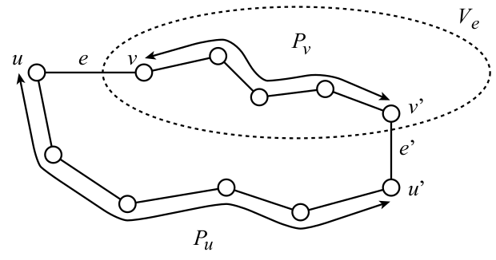

Local Connection Game
=====================

I **Local Connection Games** sono un\'altra tipologia di giochi per il
task del **Network Formation**. Consideriamo un gioco con $n$ players,
dove ogni player è rappresentato da un *nodo* della rete. Ogni nodo $u$
può decidere di *costruire* degli archi ( [non diretti]{.underline} )
verso un qualsiasi altro sottoinsieme di nodi. I giocatori hanno due
obbiettivi competitivi:

-   construire, e quindi pagare, il minor numero possibile di archi.
-   ottenere una rete che *minimizzi* la distanza verso ogni altro nodo.

Ovviamente i due obbiettivi si controbilanciano, ovvero pagare la
costruzione di troppi pochi archi comporta in automatico l\'aumento
delle distanze, e viceversa avere distanze complessivamente brevi
comporta un costo di costruzione troppo alto.

Data una configurazione di strategie $S$, indichiamo con $G(S)$ la rete
risultante.

Uniform Model
-------------

Considereremo solamente un modello **uniforme**, ovvero dove il costo di
costruzione degli archi è una certa costante $\alpha$ uguale per tutti.
Data una coppia di nod i $u,v$, indichiamo con $dist_{G(S)}(u,v)$ la
lunghezza del cammino minimo (in termine di numero di archi) tra i nodi
$u,v$ del grafo $G(S)$ risultante dal profilo di strategie $S$.
Indichiamo poi con $n_u$ il numero di archi \"comprati\" dal nodo $u$.\
Il *costo* della strategie $S$ che un nodo $u$ pagherà è $$
   COST_u(S) = \alpha n_u + \sum_v dist_{G(S)}(u,v)
   $$ il quale ovviamente si desidera [minimizzare]{.underline}.

Possiamo vedere il costo dei player come la somma di un **building
cost** (costo di costruzione) e di un **usage cost** (costo d\'uso,
ovvero le distanze tra i nodi).

Osservare che in quanto il grafo $G(S)$ è non diretto, quando un nodo
$u$ compra un arco $(u,v)$ esso sarà disponibile anche per il nodo $v$.
Perciò in un *Equilibrio di Nash* `NE` al più uno tra $u$ e $v$ comprerà
l\'arco $(u,v)$. Infatti se $(u,v)$ è comprato da entrambi gli estremi,
uno dei due può tranquillamente abbandonare quell\'arco migliorando il
proprio *building cost*.\
Inoltre dato che $dist_{G(S)}(u,v)$ è *infitia* se $u$ e $v$ non sono
connessi, allora ogni equilibrio deve necessariamente indurre un grafo
[connesso]{.underline}.\
Considereremo quindi i `NE` come soluzioni del task. Dato quindi un
equilibrio $S$, definiamo il suo **costo sociale** come la somma di
tutti i costi dei nodi. $$
   COST(S) = \alpha \vert E \vert + \sum_{u \neq v} dist_{G(S)}(u,v)
   $$ Osservare che la quantità $dist_{G(S)}(u,v)$ contribuisce due
volte al costo totale, una volta per $u$ ed una per $v$. Una soluzioni
$S$ è **ottima** se **minimizza** il costo sociale $COST(S)$.\
\*\[FARE ALCUNI ESEMPI...\]\*\

Stima dell\'Ottimo
------------------

Prima di dare delle stime per `PoA` e `PoS` è necessario individuare
qual è il costo di una soluzione ottima al problema.

> **Lemma 1** If $\alpha \geq 2$ then any *star* is an optimal solution,
> and if $\alpha \leq 2$ then the *complete graph* is an optimal
> solution.

> **Proof:** Consideriamo una soluzione ottima $G(S)$ con $m$ archi.
> Sappiamo che $m \geq n − 1$, altrimenti il grafo sarebbe disconnesso e
> quindi avrebbe un costo infinito.\
> Sappiamo con certezza che il *building cost* totale è $\alpha m$. Per
> ogni arco $(u,v)$ c\'è esattamente 1 coppia di nodi a [distanza
> 1]{.underline} (appunto $u$ e $v$) che contribuirà di un fattore 2 all
> costo sociale, una volta per $dist_{G(S)}(u,v)$ e una volta per
> $dist_{G(S)}(v,u)$.\
> Dopodiché, dato che le coppie ordinate di nodi sono $n(n-1)$, vuol
> dire che sono rimaste $n(n-1) - 2m$ coppie di nodi non direttamente
> connessi da un arco, ovvero a distanza [almeno]{.underline} 2. Perciò
> un *lowerbound* al costo sociale della soluzione $S$ è $$
> COST(S) \geq \alpha m + 2 m + 2(n(n-1) - 2m) = (\alpha - 2)m + 2n(n-1) = LB(m) 
> $$
>
> Osservare che il precedente lowerbound $LB(m)$ è pari al costo sociale
> di una clique $K_n$ quando $m=n(n-1)/2$, e pari al costo sociale di
> una stella quando $m = n - 1$.
>
> Infatti, in una clique $K_n$ tutti i nodi sono a distanza 1, perciò
> l\'*usage cost globale* è $n(n-1)$, mentre il *building cost* è
> $\alpha \frac{n(n-1)}{2}$. Perciò il costo sociale di $K_n$ è proprio
> pari al lowerbound $LB(n(n-1)/2)$, ovvero
>
> ```{=latex}
> \begin{align*}
>   COST(K_n)
>   &= \alpha \frac{n(n-1)}{2} + n(n-1)\\
>   &= \alpha \frac{n(n-1)}{2} + (2-1)n(n-1)\\
>   &= \alpha \frac{n(n-1)}{2} + 2n(n-1) - n(n-1)\\
>   &= \alpha \frac{n(n-1)}{2} + 2n(n-1) - \left(\frac{2}{2}\right)n(n-1)\\
>   &= (\alpha - 2)\frac{n(n-1)}{2} + 2n(n-1) = LB\left(\frac{n(n-1)}{2}\right)
> \end{align*}
> ```
> \
> Invece nel caso di una *stella* con $m = n-1$ archi avremo un *usage
> cost* di $2(n-1)(n-2)$ per tutte gli $n-1$ nodi a distanza 2, più
> $2(n-1)$ per le coppie a distanza 1, per un totale di
> $2(n-1)(n-2) + 2(n-1) = 2(n-1)(n-1)$. Il *building cost* globale è
> invece pari a $\alpha(n-1)$. Perciò il costo sociale per una stella è
>
> ```{=latex}
> \begin{align*}
>   COST(STAR_n)
>   &= \alpha(n-1) + 2(n-1)(n-1)\\
>   &= \alpha(n-1) + 2n(n-1) - 2(n-1)\\
>   &= (\alpha - 2)(n-1) + 2n(n-1) = LB(n-1) 
> \end{align*}
> ```
> \
> A questo punto ci si può chiedere per quali valori di $\alpha$ il
> costo sociale di $K_n$ è *migliore* (o viceversa *peggiore*) di quello
> di $STAR_n$
>
> ```{=latex}
> \begin{align*}
>   COST(K_n) \leq COST(STAR_n) &\iff LB(K_n) \leq COST(STAR_n)\\
>   \\
>   \implies (\alpha - 2)\frac{n(n-1)}{2} + 2n(n-1) &\leq (\alpha - 2)(n-1) + 2n(n-1)\\
>   \\
>   (\alpha - 2)\frac{n(n-1)}{2} &\leq (\alpha - 2)(n-1)\\
>   \\
>   (\alpha - 2)\underbrace{ \left( \frac{n(n-1)}{2} - (n-1) \right) }_{> 0} &\leq 0\\
>   \\
>   \alpha \leq 2
> \end{align*}
> ```
> Vicversa, per $\alpha \geq 2$ il costo sociale di una stella è quello
> ottimo $\square$.

Abbiamo visto che per diversi valori di $\alpha$ la clique $K_n$ o la
stella $STAR_n$ hanno un costo sociale **ottimo**. Quello che ci si può
chiedere è se tali grafi sono delle soluzioni effettive, ovvero se sono
*reti stabili*.

> **Lemma 2** If $\alpha \leq 1$ the complete graph is stable, while if
> $\alpha \geq 1$ then any star is stable.

> **Proof:** nel caso di $\alpha \leq 1$, a nessun nodo $v$ della clique
> conviene \"risparimare\" un arco. Infatti, togliendo un arco, il nodo
> $v$ guadagna di *al più* una unità, però si allontana dall\'altro
> estremo dell\'arco rimosso di esattamente 1. Perciò, nel caso migliore
> (quando $\alpha = 1$), il guadagno complessivo che $v$ ricava nel
> togliere un suo arco incidente è pari a 0. La situazione non migliora
> lo stesso se $v$ decide di elimnare $k > 1$ archi.\
> Nel caso di una stella invece non è possibile effettuare rimozioni di
> archi, in quanto causerebbe la disconnessione del grafo. Perciò un
> nodo $v$ potrebbe al più comprare nuovi archi per cercare di
> migliorare la sua situazione. Se $v$ decide di comprare $k \geq 1$
> nuovi archi, pagherà una quantità aggiuntiva di $\alpha k$,
> risparmiando esattamente $k$ nell\'usage cost. Per $\alpha \geq 1$
> tale strategia non migliora il costo del nodo $v$ $\square$.

PoS: Price of Stability
-----------------------

A questo punto è possibile quantificare il valore del prezzo della
stabilità `PoS`.

> \*THM\*\
> For $\alpha \leq 1$ and $\alpha \geq 2$ the `PoS` is 1. For
> $1 < \alpha < 2$ the `PoS` is [at most]{.underline} $4/3$.

> **Proof:** per $\alpha \leq 1$ sappiamo che la soluzione socialmente
> ottima è la clique $K_n$ e sappiamo anche che è una rete stabile,
> perciò `PoS` = 1. Stessa cosa oer $\alpha \geq 2$, la stella è la
> soluzione socialmente ottima ed è pure una rete stabile.\
> Invece per $1 < \alpha < 2$ sappiamo che $K_n$ è una soluzione ottima
> e che ogni stella (che indichiamo per brevità $T$) è stabile. Perciò
>
> ```{=latex}
> \begin{align*}
>   PoS
>   &\leq \frac{COST(T)}{COST(K_n)}\\
>   &= \frac{ (\alpha - 2)(n-1) + 2n(n-1) }{ \alpha\frac{n(n-1)}{2} + n(n-1) }\\
>   \textbf{( * )} &\leq \frac{ -1(n-1) + 2n(n-1) }{ \frac{n(n-1)}{2} + n(n-1) }\\
>   &= \frac{2n - 1}{\frac{3}{2}n} = \frac{4n - 2}{3n} \leq \frac{4}{3}
> \end{align*}
> ```
> {style="max-width:350px; width:100%"}
>
> La disuguaglianza **( \* )** è giustificata dal fatto che tale
> rapporto è massimo per $\alpha = 1$, come evince in figura $\square$.

PoA: Price of Anarchy
---------------------

Per $\alpha \leq 1$ l\'unica rete stabile è il grafo completo (da
dimostrare...), perciò costo sociale ottimo e il costo della peggiore
rete stabile coincidono, `PoA` = 1. Per valori di $\alpha > 1$ è più
complicato dare una stima di `PoA`.

> \*THM\*\
> The `PoA` is [at most]{.underline} $O(\sqrt{\alpha})$.

La dimostrazione di questo teorema è una diretta conseguenza dei
seguenti due lemmi.

> **Lemma 3** The diameter of a *Nash Equilibrium* is [at
> most]{.underline} $2\sqrt{\alpha}$.

> **Proof:** Supponiamo di avere due nodi $u,v$ a distanza
> $dist(u,v) \geq 2k$, per qualche $k > 0$. Osserviamo che succede se
> $u$ compra l\'arco $(u,v)$. Certamente il *building cost* di $u$
> aumenta di $\alpha$, mentre la distanza con la *seconda metà* dei nodi
> del cammino minimo $u \leadsto v$ diminuisce.\
> Più precisamente, la distanza $dist(u,v)$ passa da al più $2k$ ad 1.
> La distanza da $u$ al penultimo nodo del cammino passa da al più
> $2k-1$ a 2. Col precedente al penultimo passa da al più $2k-2$ a 3, e
> così via... fiano al $k-1$ esimo nodo più distante da $v$. Perciò
> l\'*usage cost* di $u$ diminuisce [al più]{.underline} della quantità
> $$
> \sum_{i=0}^{k-1} (2i-1) = k^2
> $$
>
> In una rete stabile non deve convenire ad $u$ comprare l\'arco
> $(u,v)$, e ciò accade se e solo se $\alpha \geq k^2$ $\implies$
> $k \leq \sqrt{\alpha}$. Perciò una rete è stabile se $$
> dist(u,v) \leq 2k \leq 2\sqrt{\alpha} \;\;\; \square
> $$

> **Lemma 4** If a graph $G$ at *Nash Equilibrium* has diameter $d$,
> then its social cost is [at most]{.underline} $O(d)$ times the
> *optimum* social cost.

> **Proof** Dal **Lemma 1** sappiamo che il *social cost* ottimo (che
> d\'ora in poi indicheremo con $OPT$) è almeno
> $\Omega(\alpha n + n^2) \subseteq \Omega(n^2)$ (perché $\alpha$ è una
> **costante**). Infatti dato che una soluzione è certamente una rete
> connessa dobbiamo pagare **almeno** un *building cost* di
> $\alpha(n-1)$, e dato che ci sono circa $n^2$ coppie di nodi le quali
> distanze saranno **almeno** 1, giustificando l\'*usage cost* di
> $\Omega(n^2)$.\
> Dato che per ipotesi del teorema $G$ ha diametro $d$, allora l\'*usage
> cost* sociale è $O(n^2d)$, ovvero $d$ volte $OPT$.\
> Più articolata è l\'analisi del *building cost*
> $\alpha \vert E \vert$. Come prima cosa *partizioniamo* l\'insieme di
> archi in **cut edges** $E_{cut}$, ovvero tutti quegli archi che se
> rimossi [disconnettono]{.underline} $G$, e in **non cut edges**
> $E_{non-cut}$, ovvero tutti gli archi restanti che non sono *cut
> edges*.\
> Osserviamo che i *cut edges* sono al più $n-1$, perciò il building
> cost sarà al più $\alpha(n-1)$. Dato che
> $\alpha(n-1) \in O(\alpha n + n^2)$, avremo che il *building cost* di
> $E_{cut}$ è [al più]{.underline} $OPT$.\
> Consideriamo ora $E_{non-cut}$, dimostreremo che ogni vertice $v$
> pagherà $O(nd/\alpha)$ di tali archi (*non cut edges*), perciò
> applicando tale costo per tutti gli $n$ nodi avremo il *building cost*
> totale di $E_{non-cut}$ è di
> $O(n^2d/\alpha) \subseteq O(n^2d) \subseteq O(d \cdot OPT)$.\
> Consideriamo un nodo $u$ avente almeno un *non cut edge* incidente
> $e = (u,v) \in E_{non-cut}$. Indichimo con $V_e$ l\'insieme dei nodi
> $w$, dove i shortest path $u \leadsto w$ passano attraverso $e$.
> Rimuovendo l\'arco $e$ il grafo residuo $G'$ è ancora connesso (perché
> per ipotesi $e$ è un *non cut edge*) perciò esisterà un altro cammino
> **minimo** $P$ da $u$ a $v$. Tale cammino entrerà in $V_e$ attraverso
> un arco $(u',v')$, per poi arrivare fino a $v$. $P$ sarà del tipo
> $(u, ..., u', v', ..., v)$. Per la proprietà di **sottostruttra
> ottima**[^1] dei cammini minimi avremo che $dist(u,u') \leq d$ e
> $dist(v',v) \leq d$, perciò rimuovendo $e$ la distanza tra $u$ e $v$
> sarà [al più]{.underline} $dist_{G'}(u,v) \leq 2d$.\
>
> {style="max-width:450px; width:100%"}
>
> Dato che in $V_e$ il nodo $v$ è il più vicino ad $u$, rimuovendo $e$
> le distanze da $u$ di tutti i nodi $w \in V_e$ diventeranno al più
> $dist_{G'}(u,w) \leq dist_{G'}(u,v) \leq 2d$. Quindi rimuovendo $e$,
> l\'*usage cost* di $u$ aumenterà di [al più]{.underline}
> $2d \vert V_e \vert$.\
> Perciò a un qualsiasi nodo $u$ conviene rimuovere un suo arco
> $e \in E_{non-cut}$ se e solo se $\alpha \leq 2d \vert V_e \vert$,
> ovvero se $\vert V_e \vert \geq \frac{\alpha}{2d}$. Dato che in ogni
> $V_e$ ci sono almeno $\frac{\alpha}{2d}$ nodi, allora ci sono al più
> $\frac{n}{\alpha/2d} = \frac{n2d}{\alpha}$ insiemi di quel tipo.
> Quindi per ogni nodo $u$ ci sono [al più]{.underline}
> $n\frac{2d}{\alpha}$ *non cut edges*, quindi
> $\vert E_{non-cut} \vert \leq n^2\frac{2d}{\alpha}$.\
> In conclusione avremo che il *social cost* di un grafo $G$ di diametro
> $d$ è
>
> ```{=latex}
> \begin{align*}
>   COST(G)
>   &= ( \sum_{u,v} dist_{G}(u,v) ) + \alpha \vert E \vert\\
>   &= O(d n^2) + \alpha \vert E_{cut} \vert + \alpha \vert E_{non-cut} \vert\\
>   &\leq O(d) \cdot OPT + \alpha (n-1) + \alpha O(n^2d/\alpha)\\
>   &\leq O(d) \cdot OPT + OPT + O(d) \cdot OPT = O(d) \cdot OPT \;\;\; \square
> \end{align*}
> ```

Ricapitolando, abbiamo detto che il *diametro* $d$ di una rete stabile è
al più $2\sqrt{\alpha}$, e che il suo *social cost* è al più
$O(d) \cdot OPT$. Perciò il prezzo dell\'anarchia di una rete stabile
$G$ è $$
     \texttt{PoA} = \max_{G \in NEs}{\frac{COST(G)}{OPT}} \leq \frac{ O(\sqrt{\alpha}) \cdot OPT }{ OPT } = O(\sqrt{\alpha}) 
   $$ come affermato nel teorema iniziale.\

Complessità
-----------

Generalmente dare queste stime al prezzo dell\'anarchia e della
stabilità può sembrare incoraggiante, perché ci fa ben sperare di
trovare una buana soluzione a problema del *Network Formation*.
Purtroppo però bisogna anche considerare quanto può essere complicato
per un player individuare qual è la strategia migliore da adottare.

> **THM** It is *NP*-hard, given the strategies of the other agents, to
> compute the best response of a given player.

> **Proof:** verrà mostrata una riduzione polinomiale dal problema
> NP-completo *Dominating Set Problem* (`DSP`). $$
> \texttt{DSP} \preccurlyeq_P \texttt{LCG}
> $$
>
> Un\'istanza di `DSP` è un grafo $G=(V,E)$, e si vuole trovare un
> sottoinsieme di nodi $U \subseteq V$ tale che
> $\forall v \in V \setminus U$ esiste almeno un $u \in U$ vicino di
> $v$, ovvero $(u,v) \in E$. In tal caso si dice che $U$ è un *insieme
> dominante*. Il problema decisionale NP-completo riguardo gli insiemi
> dominanti è stabilire se, dato un $k \geq 1$, esiste un dominating se
> grande [al più]{.underline} $k$.\
>
> {style="max-width:200px; width:100%"}
>
> Consideriamo volri di $\alpha$ compresi tra 1 e 2. Per ogni player $i$
> aggiungiamo un nuovo al grafo. A questo punto il player $i$ dovrà
> scegliere quali archi costruire per ottenere un guadagno ottimo (per
> se stesso). È possibile dimostrare che il player $i$ ha una strategia
> *better response* $S_i$ di costo [al più]{.underline}
> $\leq \alpha k + 2n -k$ **se e soltanto se** esiste in
> $G(V,E) = G(S_{-i})$ un *dominating set* di dimensione [al
> più]{.underline} $\leq k$.\
> Dato un dominating set grande al più $k$ è facile ricavare una
> strategia better response $S_i$ col costo desidera. Basterà infatti
> che $i$ compri un arco verso ognuno dei nodi nel dominating set.
>
> {style="max-width:200px; width:100%"}
>
> $\Longleftarrow$
> :   Analiziamo il costo di $COST_i(S_i)$. Sicuramente il building cost
>     stara al più $\alpha k$. Per quanto riguarda l\'usage cost,
>     pagherà 1 per tutti i nodi nel nel dominating set, e 2 per i
>     restanti $n-k$ nodi. Perciò l\'usage cost sarà al più
>     $2(n-k) + k = 2n - k$. In conclusione, se in $G$ esiste un
>     dominating set di dimensione $k$, $i$ riesce a trovare
>     immediatamente una strategia better response di costo al più
>     $\alpha k + 2n - k$.
>
> $\Longrightarrow$
> :   Sia $S_i$ una strategia di costo al più $k$. Se in $G$ esiste un
>     nodo $v$ a distanti più di 2 da $i$, aggiungere ad $S_i$ l\'arco
>     $(i,v)$. Osservare che il building cost di $S_i$ aumenta di
>     $\alpha < 2$, per l\'usage cost risparmia un fattore di
>     [almeno]{.underline} 2, perché stiamo avvicinando $v$ che era a
>     distanza $\geq 3$ a distanza 1. Ripetiamo questo passaggio finché
>     tutti nodi non saranno a distanza 1 o 2 da $i$. Creiamo ora il
>     dominating set $U$ semplicemente inserendo tutti i nodi che sono
>     distanti 1 da $i$. È facile convincersi che $U$ sia un dominating
>     set, perché tutti gli altri nodi sono distanti 2 da $i$, e quindi
>     hanno almeno un vicino in $U$. Infine basta osservare che la nuova
>     strategia $S_i$ ha costo esattamente
>     $\alpha \vert U \vert + 2n  - \vert U \vert \leq \alpha k + 2n - k$,
>     ovvero $\vert U \vert \leq k$ $\square$.

------------------------------------------------------------------------

[^1]: ogni sottocammino minimo di un cammino minimo è un cammino minimo.
