Meccanismi one-parameter
========================

Problema dello *Shortest Path Egoistico*
----------------------------------------

Siamo in uno scenario in cui gli archi di un grafo sono controllati da
*agenti egoistici*, e si vuole costruire un *cammino minimo* tra una
coppia di nodi stabiliti. Ogni agente conosce segretamente il peso del
proprio arco, e si desidera che il cammino (in quanto minimo)
**minimizzi** la somma di tutti i pesi degli archi scelti.\
Più formalmente, l\'input del problema è un grafo pesato
$G=(V,E, c: E \rightarrow \mathbb{R}^+)$, una coppia di nodi $s$
*sorgente* e $t$ *destinazione*, e per ogni arco in $E$ esiste un player
egoistico che lo possiede. Il tipo privato di un player $i$ è pari al
peso dell\'arco $e_i$, ovvero $t_i = c(e_i)$. Si vuole trovare un
sottoinsieme di player tale che i rispettivi archi creano un *cammino*
$s \leadsto t$ e tali da minimizzare la somma dei rispettivi *pesi* (o
*tipi*).\
Se un arco $e_i$ viene scelto per appartenere al cammino minimo, allora
il rispettivo player pagherà una quantità pari al peso dell\'arco $t_i$.
Tale costo può essere visto come una sorta di **costo d\'utilizzo**.
Ovvero la **valutazione** dei player sarà $$
   v_i(t_i, P) = \begin{cases}
   t_i &\mbox{se } e_i \in P\\
   0 &\mbox{se } e_i \notin P
   \end{cases}
   \;\;\; \forall P \in F
   $$ L\'insieme dei possibili outcomes $F$ equivale all\'insieme di
tutti i possibili cammini da $s$ a $t$ in $G$.\
Osserviamo che, per come è stato descritto il meccanismo fin ora, ogni
player è disincentivato a dichiarare il proprio tipo privato, ma che
piuttosto è spinto a dichiarare un tipo il più alto possibile per
evitare di essere scelto. Si desidera quindi progettare un meccanismo
$M$, il cui schema di pagamenti $p$ incentivi i player a dichiarere il
proprio tipo privato, ovvero si vuole progettare un meccanismo
**truthfull** per questo problema.\
Un\'osservazione chiave che si può fare è che tale problema è un
**[problema utilitario](./22.html)**, ovvero perché la funzione
obiettifo $f(t)$ minimizza la [somma di tutte le
valutazioni]{.underline}. Ovvero sia un cammino minimo $f(t) = P \in F$
da $s$ a $t$, allora avremo che $$
   \sum_{e \in P} c(e) = \sum_{e \in E} v_e(t_e, P)
   $$\
Infatti, ponendo l\'algoritmo $$
   g(r) = arg \min_{x \in F} \sum_j v_j(r_j, x)
   $$ possiamo definire uno schema di pagamenti $p$ in accordo al
meccanismo `VCG` visto nella [precedente lezione](./22.html), come segue
$$
   p_e(r) = \sum_{j \neq e} v_j(r_j, g(r_{-e})) -  \sum_{j \neq e} v_j(r_j, g(r))
   $$ ovvero se un arco $e$ viene scelto per una soluzione $g(r)$ il suo
pagamento sarà pari alla distanza tra $s$ e $t$ nel grafo
$G=(V, E \setminus \lbrace e \rbrace)$ *meno* la distanza tra $s$ e $t$
in $G$ contando tutti gli archi del cammino eccetto $e$. Più
semplicemente $$
   p_e(r) = \begin{cases}
   d_{G-e}(s,t) - \left( d_G(s,t) - r_e \right) &\mbox{se } e \in P_G(s,t)\\
   0 &\mbox{altrimenti}
   \end{cases}
   $$ Indicando con $P_G(s,t)$ il cammino minimo $s \leadsto t$ per il
grafo $G=(V, E, r)$, e con $P_{G-e}(s,t)$ il **cammino di rimpiazzo** ad
$e$ per il grafo $G-e=(V, E \setminus \lbrace e \rbrace, r_{-e})$.\
Per fare chiarezza, consideriamo il seguente esempio.

{style="max-width:200px; width:100%"}

Per esempio un cammino minimo da $s$ a $t$ è quello con gli archi di
peso `4-2-5` (come in figura).

{style="max-width:200px; width:100%"}

Consideriamo l\'arco $e$ centrale al cammino minimo, e proviamo a
calcolare il suo schema di pagamento $p_e$. Innanzitutto calcoliamo la
quantità $$
   d_G(s,t) - r_e = 11 - 2 = 9
   $$ Dopodichè rimuoviamo l\'arco $e$ e calcoliamo il *cammino di
rimpiazzo* $P_{G-e}(s,t)$.

{style="max-width:200px; width:100%"}

La lunghezza del cammino di rimpiazzo $P_{G-e}(s,t)$ sarà pari a $$
   d_{G-e}(s,t) = 12
   $$

Perciò il pagamento del player $e$ sarà $$
   p_e(r) = d_{G-e}(s,t) - \left( d_G(s,t) - r_e \right) = 12 - 9 = 3
   $$

Per concludere bisogna imporre come ulteriore restrizione che la
sorgente e la destinazione devono essere **2-edges connessi**. Ciò
signifa che per disconnetere $s$ e $t$ è necessario rimuovere
[almeno]{.underline} 2 archi, la rimozione di un solo arco non è
sufficiente. Infatti, se $s$ e $t$ non fossero **2-edges connessi**
allora esiste un arco $e$ che disconnette $s$ da $t$, e tale arco deve
necessariamente appartenere al cammino minimo $P_G(s,t)$. Però, nel
grafo $G-e$ i due nodi $s,t$ risulterebbe disconnessi, con distanza
$d_{G-e}(s.t) = \infty$

### Complessità del calcolo dei cammini di rimpiazzo

Supponiamo di aver individuato un cammino minimo $P_G(s,t)$ di lunghezza
minima in $G=(V,E,r)$. Per sempio abbiamo calcolato tale cammino con
l\'[algoritmo di
Dijkstra](https://en.wikipedia.org/wiki/Dijkstra%27s_algorithm) in tempo
$O(m + n\log{n})$. Supponiamo che il cammino $P_G(s,t)$ sia composto da
$k$ archi. Per avere uno schema di pagamento dobbiamo calcolare il
cammino minimo residuo per oguno dei $k$ archi in $P_G(s,t)$. Supponendo
di calcolare i camminimi minimi con lo stesso algoritmo (ovvero quello
di *Dijkstra*), allora avremo che è possibile calcolare lo schema di
pagamenti in tempo $O(k(m + n \log{n}))$. Se $k \in O(n)$, allora
risulta particolarmente non efficiente calcolare $p(r)$, il quale
richiederà un tempo di $O(nm + n^2\log{n})$.\
Per fortuna esiste un risultato che mostra come è possibile calcolare i
$k$ cammini di rimpiazzo in tempo $O(m + n\log{n})$.

Shortest Path Tree (SPT) non cooperativo
----------------------------------------

Questo problema è molto simile al precedente, con la differenza che si
desiderano trovare tutti i cammini minimi che partono da una data
sorgente $s$, ovvero uno `Shortest Path Tree` (in breve `SPT`)
*radicato* in $s$. Come sempre, i player hanno informazioni private,
ovvero i pesi degli archi, che in qualche modo stanno ad indicare il
*tempo di attraversamento* o il *costo di utilizzo* dell\'arco in
questione. Ogni player dichiara un tipo, e si desidera progettare un
meccanismo $M$ che induca tutti i player a dichiarere i tipi reali (i
reali pesi degli archi), ovvero si desidera progettare un **meccanismo
truthfull** per questo problema.\
L\'insieme $F$ dei possibili outcomes è formato da tutti gli *alberi
ricoprenti* $T$ di $V$. Definiamo la funzione di scelta sociale
$f(\cdot)$ come segue $$
   f(t) = arg \min_{T \in F} \sum_{v \in V} d_T(s,v) = arg \min_{T \in F} \sum_{e \in E(T)} c(e) \cdot \Vert e \Vert
   $$ ovvero $f(t)$ è pari alla somma di tutte le distanze da $s$ nello
`SPT` radicato in $s$. La quantità $\Vert e \Vert$ sta ad indicare la
**molteplicità** dell\'arco $e$, ovvero quante volte viene contato
l\'arco $e$ nel conteggio delle distante di tutti i $d_T(s,v)$. Infatti
considerando la seguente figura, possiamo dire che l\'arco $(x_1, x_2)$
ha molteplicità 2 in quanto è conteggiato nel calcolo delle distante
$d_T(x_1, x_2)$ e $d_T(x_1, x_4)$, l\'arco $(x_1, x_3)$ avrà
molteplicità 3, e gliarchi $(x_2, x_4), (x_3, x_5), (x_3, x_6)$ avranno
molteplicità 1.

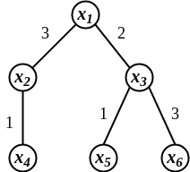{style="max-width:250px; width:100%"}

A questo punto ci si può chiedere se questo è un problema utilitario, e
quindi risolvibile con il meccanismo `VCG`. Questo dipende dalla
funzione di valutazione dei player. Per esempio, se siamo in un contesto
in cui la sorgente $s$ costruisce uno `SPT` con l\'intento di mandare in
broadcast un messaggio, allora le singole connessioni verranno
attraversate una sola volta, perciò ha senso porre la valutazione di un
arco $e$ appartenente allo `SPT` pari al suo costo d\'utilizzo (ovvero
al suo peso). Quindi avremo che $$
   v_e(t_e, T) = \begin{cases}
   t_e &\mbox{se } e \in E(T)\\
   0   &\mbox{altrimenti}
   \end{cases}
   \;\;\; \forall T \in F
   $$ In tal caso avremo che il problema non è utilitario in quanto la
funzione di scelta sociale non è pari alla somma di tutte le valutazioni
$$
   f(t) = arg \min_{T \in F} \sum_{e \in E(T)} t_e \cdot \Vert e \Vert \neq arg \min_{T \in F} \sum_{e \in E(T)} t_e
   $$

Problemi one-parameter
----------------------

Il problema precedentemente descritto è noto appartenere ad una classe
di problemi detti **problemi one-parameter**, o anche problemi a
**singolo parametro**. Un problema è detto a singolo parametro se:

1.  L\'informazione posseduta da ogni singolop player $i$ è un **singolo
    parametro** $t_i \in \mathbb{R}$, ovvero non può per esempio essere
    un vettore di $n$ elementi.
2.  La valutazione di ogni player $i$ è del tipo $$
      v_i(t_i, x) = t_i \cdot w_i(x)
      $$ dove $w_i(x)$ indica il **carico di lavoro** del player $i$
    rispetto alla soluzione $x$.

Osservare che il problema dello `SPT` *non cooperativo* è un problema a
singolo parametro, in quanto i tipi privati sono [singoli valori
reali]{.underline}, mentre basta porre le valutazioni come $$
     v_e(t_e, T) = t_e \cdot w_e(T)\\
     w_e(T) = \begin{cases}
       1 &\mbox{se } e \in E(T)\\
       0 &\mbox{altrimenti}
     \end{cases}\\
   $$ $$
     \implies v_e(t_e, T) = \begin{cases}
       t_e &\mbox{se } e \in E(T)\\
       0 &\mbox{altrimenti}
     \end{cases}\\
   $$

### VCG vs OP

Le principali differenze tra meccanismi `VCG` e `OP` sono:

-   **VCG**: non ci sono vincoli su come devono essere i tipi e le
    valutazioni, ma si richiede che la funzione di costo sociale debba
    essere pari alla somma delle valutazioni (problemi utilitari)
-   **OP**: non c\'è vincolo su come deve essere fatta la funzione di
    costo sociale, ma si richiede che i tipi siano valori reali e che la
    valutazione di un individuo deve essere pari al suo tipo privato
    moltiplicato il carico di lavoro.

Le due classi di problemi non si includono, ma si intersecano. Ciò
significa che esistono problemi utilitari che non sono a singolo
parametro e viceversa, oppure che esistono problemi che sono sia
utilitari che a singolo parametro. In questo ultima cosa i meccanismi
`VCG` e `OP` **coincidono**.

### Algoritmo monotono

Un algoritmo $g(\cdot)$ per un problema *one-parameter di
minimizzazione* si dice **monotono** se per ogni agente $i$,
$w_i(g(r_{-i},r_i))$ è [non crescente]{.underline} rispetto a $r_i$,
qualunque siano $r_{-i}=(r_1, ..., r_{i-1}, r_{i+1}, ..., r_n)$. Perciò
se consideriamo il carico di lavoro $w_i(g(r))$, esso non crescerà mai
al crescere del parametro $r_i$.\
Per comodità d\'ora in poi ci riferiremo al valore $w_i(g(r))$
semplicemente con $w_i(r)$.

> **THM 1** /(Mayerson '81)/\
> Condizione necessaria affinché un meccanismo
> $M = \langle g(r), p(r) \rangle$ per un problema `OP` sia
> [veritiero]{.underline} è che $g(r)$ sia monotono. Ovvero dato un
> problema `OP`, un relativo meccanismo $M$ [veritiero]{.underline} per
> tale problema ha necessariamente $g(\cdot)$ monotono.

> **Proof:** Supponiamo per assurdo di avere un meccanismo $M$ truthfull
> per un problema `OP` di minimizzazione, con algoritmo $g(\cdot)$ [non
> monotono]{.underline}. Verrà mostrato che non è possibile trovare
> alcuno schema di pagamento $p$ che renda $M$ veritiero.\
> Se $g$ non è monotona, allora esisterà un certo agente $i$ e un
> vettore $r_{-i} \in \mathbb{R}^{n-1}$ tale che la funzione carico di
> lavoro $w_i(r_{-i}, r_i)$ è non [\"non crescente\"]{.underline}
> rispetto alla variabile $r_i$. Ovvero esisteranno due valori $x < y$
> tale che $w_i(r_{-i}, x) < w_i(r_{-i}, y)$.
>
> 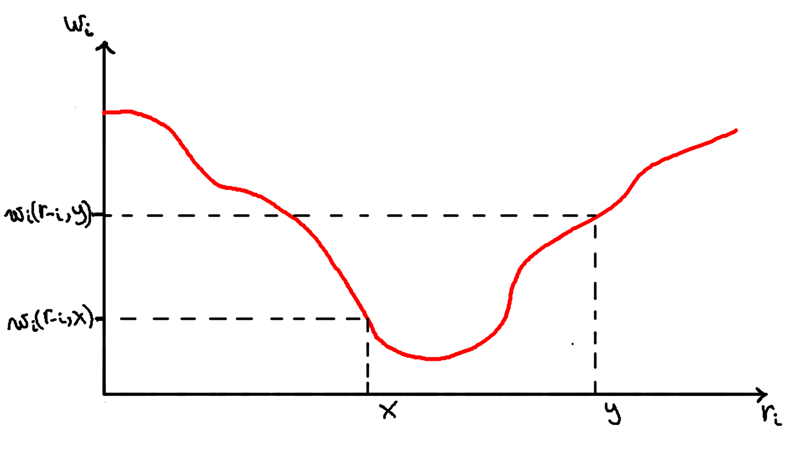{style="max-width:550px; width:100%"}
>
> \*Caso $i$ sincero\*\
> Consideriamo il caso in cui il player $i$ dichiara la verità
> $r_i = t_i$. Se il tipo del player $i$ è pari a $t_i = x$ allora la
> sua valutazione sarà uguale all\'area in `verde`
> $x \cdot w_i(r_{-i}, x)$
>
> 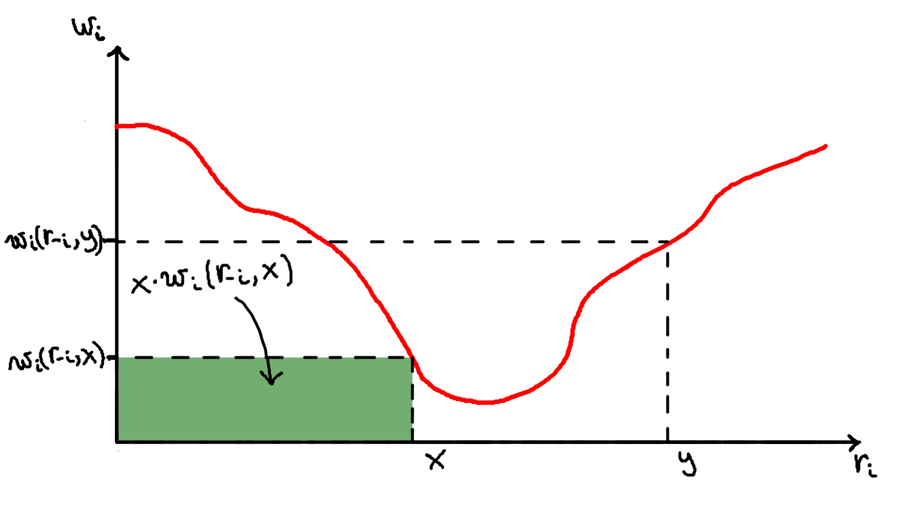{style="max-width:550px; width:100%"}
>
> mentre se pari a $t_i = y$ assumerà il valore dell\'area in `viola`
> $y \cdot w_i(r_{-i}, y)$
>
> 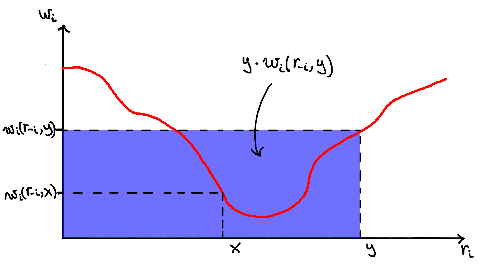{style="max-width:550px; width:100%"}
>
> \*Caso $i$ non sincero\*\
> Consideriamo il caso in cui il player $i$ [non]{.underline} dichiara
> la verità $r_i \neq t_i$. Possono succedere due cose, o $i$ dichiara
> di [più]{.underline} del suo tipo, per esempio $r_i = y > x = t_i$,
> oppure $i$ dichiara [meno]{.underline} del reale, per esempio
> $r_i = x < y = t_i$.\
> Se $i$ dichiara [più]{.underline} di $t_i$, allora la sua valutazione
> sarà pari a $x \cdot w_i(r_{-i}, y)$, ovvero all\'area `GIALLA` in
> figura.
>
> 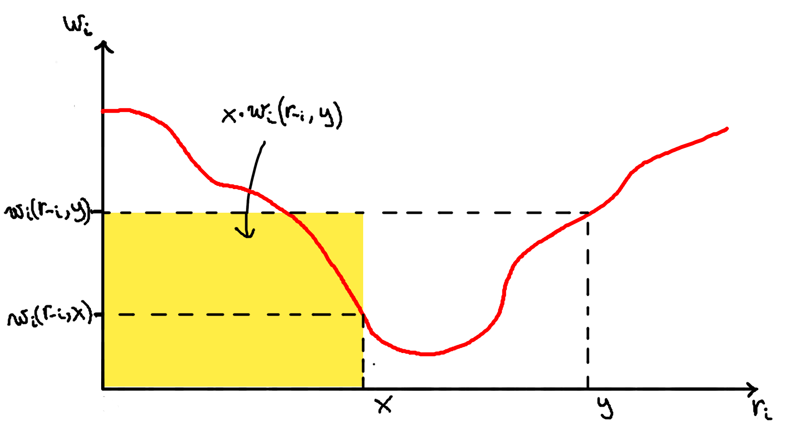{style="max-width:550px; width:100%"}
>
> Viceversa, se dichiara [meno]{.underline} del tipo reale $t_i$, allora
> la sua valutazione sarà pari a $y \cdot w_i(r_{-i}, x)$, ovvero
> all\'area `AZZURRA` in figura.
>
> 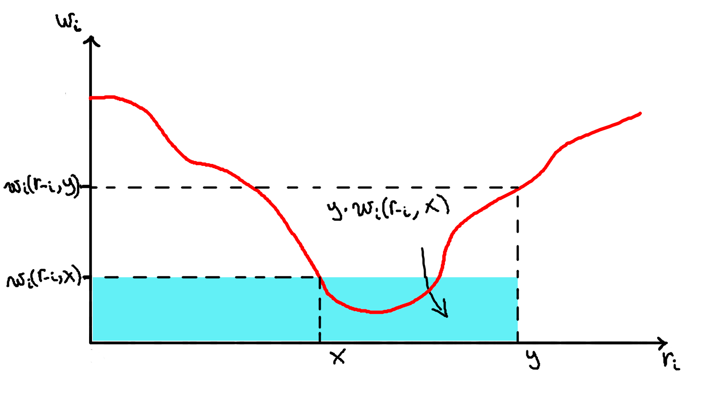{style="max-width:550px; width:100%"}
>
> Considerando i seguenti rettangoli nella figura contrassegnati come
> `A` e `k`, possiamo ricapitolare i 4 possibili scenari appena visti
> come segue:
>
> 1.  se
>     $r_i = t_i = x \implies v_i(t_i, \star) = x \cdot w_i(r_{-i}, x)$
> 2.  se
>     $r_i = t_i = y \implies v_i(t_i, \star) = y \cdot w_i(r_{-i}, y)$
> 3.  se $r_i = y > x = t_i$
>     $\implies v_i(t_i, \star) = x \cdot w_i(r_{-i}, y)$ $\implies$ $i$
>     **aumenta** il suo costo di `A`
> 4.  se $r_i = x < y = t_i$
>     $\implies v_i(t_i, \star) = y \cdot w_i(r_{-i}, x)$ $\implies$ $i$
>     **diminuisce** il suo costo di `A + k`
>
> 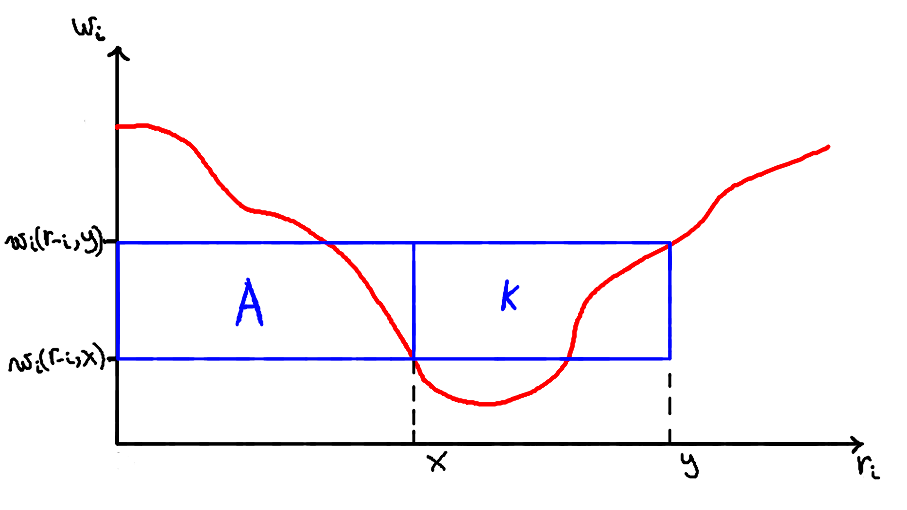{style="max-width:550px; width:100%"}
>
> Vediamo ora la differenza d\'utilità in base alle possibili
> dichiarazioni che $i$ può fare, $x$ o $y$. Supponiamo di avere un
> meccanismo $M$ [truthfull]{.underline}, e indichiamo con
> $\Delta p = p_i(r_{-i}, y) - p_i(r_{-i}, x)$ il pagamento che il
> meccanismo $M$ da ad $i$ se dichiara $y$ meno il pagamento che avrebbe
> dichiarando $x$. Ovviamente i pagamenti dipendono solamente dai tipi
> riportati e non da quelli reali, in quanto il meccanismo non conosce i
> tipi reali.
>
> $\Delta p \leq A$
> :   Se $\Delta p > A$ e $t_i = x$, allora al player converrebbe
>     mentire e riportare $r_i = y$. Infatti se $i$ fosse sincero
>     dichiarando $r_i = t_i = x$ avrebbe un certo pagamento
>     $p_i(r_{-i}, x)$, mentre se dichiara di più $r_i = y > x = t_i$,
>     il suo costo aumenterebbe di `A`, ma il suo pagamento aumenterebbe
>     di quantità **maggiore** di `A` (risultando in una utilità
>     migliore). Perciò affinché $M$ sia *truthfull*, allora
>     necessariamente deve essre che $\Delta p \leq A$.\
>
> $\Delta p \geq A+k$
> :   Se invece $\Delta p < A+k$ e $t_i = y$, allora al player
>     converrebbe mentire e riportare $r_i = x$. Infatti se $i$ fosse
>     sincero dichiarando $r_i = t_i = y$ avrebbe un certo pagamento
>     $p_i(r_{-i}, y)$, mentre se dichiara di meno $r_i = x < y = t_i$,
>     il suo costo diminuirebbe di `A+k`, mentre il suo pagamento
>     diminuirebbe di una quantità **minore** di `A+k` (risultando
>     ancora una volta in una utilità migliore). Perciò un\'altra
>     condizione affinché $M$ sia *truthfull* è che
>     $\Delta p \geq A + k$.\
>
> Infine, dato che per assunzione $x < y$ e
> $w_i(r_{-i}, x) < w_i(r_{-i}, y)$, allora l\'area di `k` è [non
> nulla]{.underline}. Perciò se $M$ è *truthfull* con funzione
> $g(\cdot)$ non monotona, allora incorreremo in uno schema di pagamento
> tale che $\Delta p \leq A$ e $\Delta p > A$ (**assurdo!**) $\square$.

### Meccanismi one-parameter

È possibile progettare un meccanismo **truthfull** $M$ *one-parameter*
per i problemi `OP`. Tale meccanismo è definito come segue:

-   $g(r)$ un qualsiasi algoritmo **monotono**
-   sia $h_i(r_{-i})$ una qualsiasi funzione *indipendente* da $i$,
    allora possiamo porre lo schema di pagamanto di $i$ pari a $$
     p_i(r) = h_i(r_{-i}) + r_i \cdot w_i(r) - \int_{0}^{r_i}w_i(r_{-i}, z)\,dz
     $$

> **THM 2** /(Mayerson '81)/\
> Un meccanismo `OP` (per un problema `OP`) è veritiero.

> **Proof:** Basta far vedere che qualsiasi strategia che non sia
> dichiarare il vero è sempre peggiore.\
> Fissiamo un generico player $i$, e consideriamo una
> [qualsiasi]{.underline} configurazione di strategie $r_{-i}$ (per
> tutti gli altri player eccetto $i$). Considerando uno schema `OP` come
> quello visto in precedenza, poniamo la funzione $h_i(r_{-i}) = 0$ in
> quanto ininfluente dato che [indipendente]{.underline} da $r_i$.
> Supponiamo che $i$ dichiari un certo tipo $r_i$ ed indicando con
> $r = (r_{-i},r)$, avremo che il suo pagamento sarà $$
> p_i(r) = r_i \cdot w_i(r) - \int_{0}^{r_i}w_i(r_{-i}, z)\,dz
> $$
>
> Calcoliamo ora quanto vale l\'utilità di $i$ se dovesse dichiarare il
> suo tipo reale $t_i$
>
> ```{=latex}
> \begin{align*}
>   u_i(t_i, (r_{-i}, t_i)) &= p_i(r_{-i}, t_i) - v_i(t_i, g(r_{-i}, t_i))\\
>   &= t_i \cdot w_i(r_{-i}, t_i) - \int_{0}^{r_i} w_i(r_{-i}, z)\,dz - t_i \cdot w_i(r_{-i}, t_i)\\
>   &= - \int_{0}^{r_i} w_i(r_{-i}, z)\,dz
> \end{align*}
> ```
> 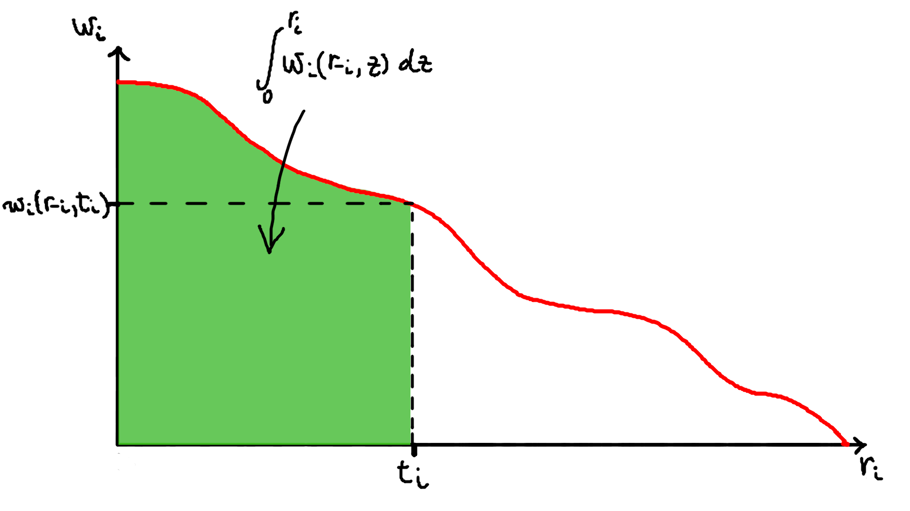{style="max-width:550px; width:100%"}
>
> \*Caso $i$ dichiara $x > t_i$\*\
> Se $i$ dichiara un tipo maggiore di quello reale $x > t_i$ avremo che
> l\'utilità diminuisce.
>
> ```{=latex}
> \begin{align*}
>   u_i(t_i, (r_{-i}, x))
>   &= \underbrace{ x \cdot w_i(r_{-i}, x) - \int_{0}^{x} w_i(r_{-i}, z)\,dz }_{- P} - \underbrace{ t_i \cdot w_i(r_{-i}, x) }_{ C }\\
>   &= u_i(t_i, (r_{-i}, t_i)) - G
> \end{align*}
> ```
> 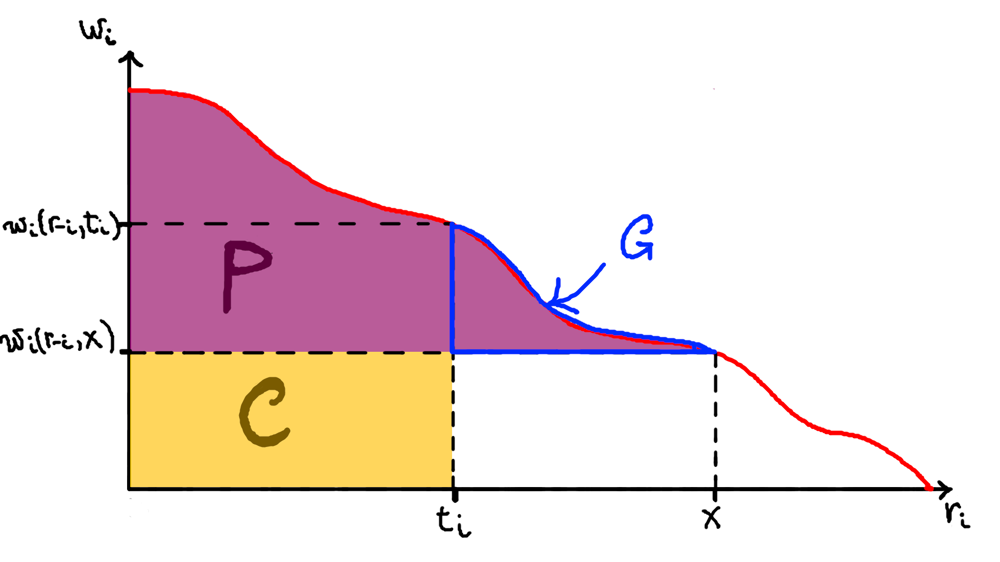{style="max-width:550px; width:100%"}
>
> \*Caso $i$ dichiara $x < t_i$\*\
> Anche se $i$ dichiara un tipo minore di quello reale $x < t_i$ avremo
> che l\'utilità diminuisce. $$
> u_i(t_i, (r_{-i}, x)) = - P - C = u_i(t_i, (r_{-i}, t_i)) - G
> $$
>
> 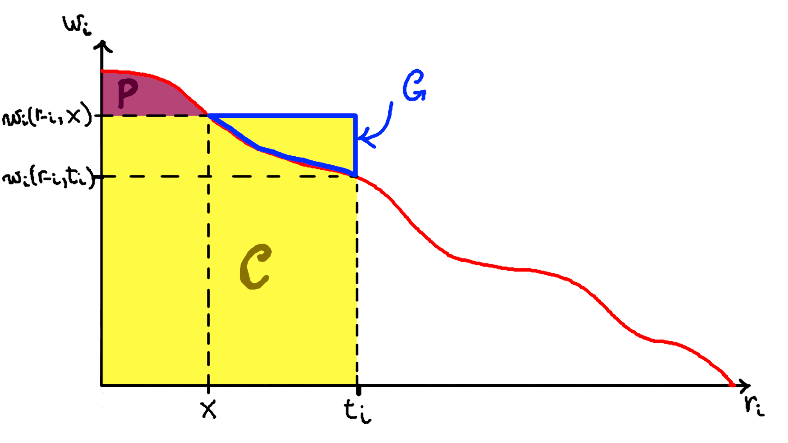{style="max-width:550px; width:100%"}
>
> Perciò, se $i$ mente la sua utilità non può che peggiorare $\square$.

### Sulla funzione $h_i(r_{-i})$

Un meccanismo garantisce la **volontaria partecipazione** dei player se
l'utilità di un qualsiasi agente (che dichiara il vero) ha sempre un
utile non negativo, altrimenti non avrebbe senso partecipare al gioco.\
Ponendo $h_i(r_{-i}) = 0$ (come nella dimostrazione precedente)
otterremo in ogni caso un\'utilità negativa. Perciò per ottenere utilità
positiva si vuole ([per chi dichiara il vero]{.underline}) che $$
    p_i(r_{-i}, t_i) > v_i(t_i, g(r_{-i}, t_i))\\
    \\
    h_i(r_{-i}) + t_i \cdot w_i(r_{-i}, t_i) - \int_{0}^{r_i} w_i(r_{-i}, z)\,dz > t_i \cdot w_i(r_{-i}, t_i)\\
    \\
    h_i(r_{-i}) - \int_{0}^{r_i} w_i(r_{-i}, z)\,dz > 0\\
    \\
    h_i(r_{-i}) > \int_{0}^{r_i} w_i(r_{-i}, z)\,dz
    $$ Dato che $w_i(\cdot)$ è decrescente rispetto ad $r_i$ (per via
della monotonia di $g$), possiamo porre $$
    h_i(r_{-i}) = \int_{0}^{\infty} w_i(r_{-i}, z)\,dz
    $$ e di conseguenza il pagamanto diventa pari a

```{=latex}
\begin{align*}
      p_i(r_{-i}, r_i) &= \int_{0}^{\infty} w_i(r_{-i}, z)\,dz + r_i \cdot w_i(r_{-i}, r_i) - \int_{0}^{r_i} w_i(r_{-i}, z)\,dz\\
      &= r_i \cdot w_i(r_{-i}, r_i) + \int_{r_i}^{\infty} w_i(r_{-i}, z)\,dz
\end{align*}
```
Perciò l\'utilità di un agente $i$ che [dichiara il vero]{.underline}
sarà sempre non negativa $$
    u_i(t_i, g(r_{-i}, t_i)) = \int_{t_i}^{\infty} w_i(r_{-i}, z)\,dz \geq 0
    $$

Meccanismo `OP` per il problema dello SPT non cooperativo
---------------------------------------------------------

Ritornando al problema dello *Shortest Path Tree (`SPT`) non
cooperativo*, possiamo definire un *meccanismo one-parameter*
**truthfull**. Abbiamo già visto in precedenza che tale problema non è
utilitario, bensì a singolo parametro, con funzione di scelta sociale $$
   f(t) = arg \min_{T \in F} \sum_{v \in V} d_T(s,v) = arg \min_{T \in F} \sum_{e \in E(T)} t_e \cdot \Vert e \Vert
   $$ e con valutazione $v_e(t_e, T) = t_e \cdot w_e(T)$, dove
$w_e(T) = 1$ se l\'arco $e$ viene scelto nella soluzione, 0 altrimenti.\
Per quanto visto fin ora, un possibile meccanismo truthfull
$M_{SPT} = \langle g(r), p(r) \rangle$ può essere

-   $g(r)$: dato il grafo $G$ e le dichiarazioni $r$, calcola uno
    *shortest path tree* per il grafo pesato $G=(V,E,r)$ usando
    l\'algoritmo di Dijkstra.
-   $p(r)$: per ogni arco $e \in E$ poni il pagamento del relativo
    player pari a $$
     p_e(r) =  r_e \cdot w_i(r_{-e}, r_e) + \int_{r_e}^{\infty} w_e(r_{-e}, z)\,dz
     $$ così da garantire la partecipazione volontaria.

### Truthfulness

Per dimostrare la truthfulness del maccanismo $M_{SPT}$ appena
descritto, è necessario che l\'algoritmo di Dijkstra usato per calcolare
$g(r)$ è monotono. Osservare che se un player $e$ dichiara un valore
[più piccolo]{.underline} del suo tipo $t_e$ verrà comunque scelto nella
soluzione finale. Perciò esisterà un certa *soglia critica*
$\theta_e \geq t_e$ tale che:

-   se $e$ dichiara al più il valore della soglia (ovvero
    $r_e \leq \theta_e$) allora viene scelto nella soluzione.
-   se $e$ dichiara più della soglia (ovvero $r_e > \theta_e$) allora
    non viene scelto nella soluzione.

Perciò per ogni player $e$ la sua funzione carico di lavoro $w_e$ sarà
non crescente di $r_e$, ovvero della forma

{style="max-width:350px; width:100%"}

### Sui pagamenti

È facile osservare che se l\'arco $e$ non è presente nella soluzione
allora il pagamento sarà nullo $p_e(r) = 0$. Infatti, se $e$ non è stato
scelto, allora avrà certamente dichiarato $r_e > \theta_e$. Perciò il
pagamento sarà $$
    p_e(r) = r_e \cdot 0 + \int_{r_e}^{\infty} 0 \,dz = 0 
    $$

Viceversa se $e$ è nella soluzione, allora $p_e(r) = \theta_e$. Infatti
dato che $r_e \leq \theta_e$ allora il pagamento sarà $$
    p_e(r) = r_e \cdot 1 + \int_{r_e}^{\infty} 1 \,dz = r_e + \theta_e - r_e = \theta_e
    $$

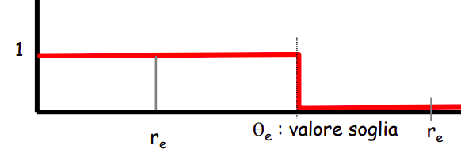{style="max-width:350px; width:100%"}

Binary Demand: un caso speciale dei problemi `OP`
-------------------------------------------------

Una sottocategoria dei problemi a singolo parametro è nota come **Binary
Demand** (`BD`). Un problema è detto `BD` se tale problema è a singolo
parametro con la restrizione che la funzione di *carico di lavoro* è
binaria, ovvero se per ogni player $i$ avremo che $$
   w_i(x) = \begin{cases}
     1 &\mbox{se } i \in x\\
     0 &\mbox{altrimenti}
   \end{cases}
   \;\;\; \forall x \in F
   $$\
Osserviamo quindi che un algoritmo $g$ per un problema `BD` è *monotono*
se per ogni player $i$, e per ogni combinazione di strategie degli altri
player $r_{-i} = (r_1, r_2, ..., r_{i-1}, r_{i+1}, ..., r_{n})$, la
funzione di carico di lavoro $w_i$ al crescere di $r_i$ sarà della forma

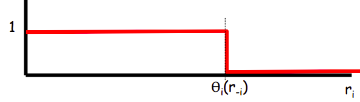{style="max-width:350px; width:100%"}

dove $\theta_i(r_{-i})$ indica la soglia di accettazione di $i$ nella
soluzione, rispetto però alle scelte fatte dagli altri in $r_{-i}$.\
Da quanto visto in precedenza per il problema dello `SPT`, possiamo dire
che il pagamanto del player $i$ sarà pari a $$
   p_i(r_{-i}, r_i) = \theta_{i}(r_{-i})
   $$

### Sulle soglie

Ritornando al problema dello `SPT` non cooperativo, sappiamo che un arco
$e$ appartiene alla soluzione finché la sorgente $s$ utilizza $e$ per
raggiungere un nodo $v$. Perciò affinché $e$ sia incluso nella
soluzione, è necessario che qualsiasi altro suo cammino di rimpiazzo
$P_{G-e}(r_{-e}, r_e)$ sia maggiore del cammino $P_G(r_{-e}, r_e)$.

Possiamo quindi dire che la soglia di adozione per l\'arco $e$ nella
soluzione è pari a $$
    \theta_e = d_{G-e}(s,v) - d_G(s,v)
    $$

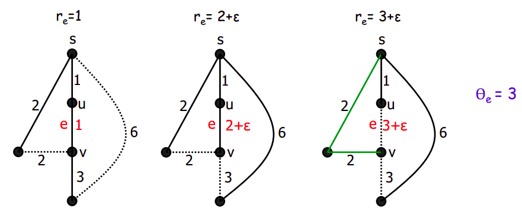{style="width:100%"}

------------------------------------------------------------------------
