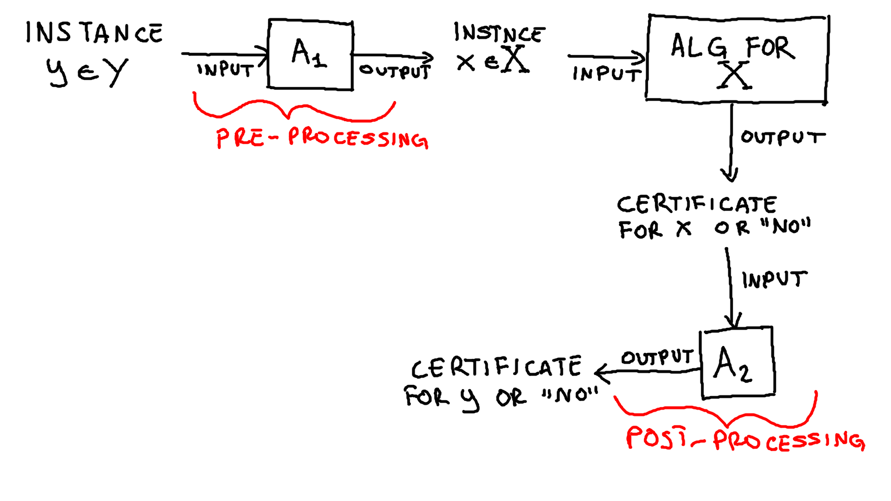
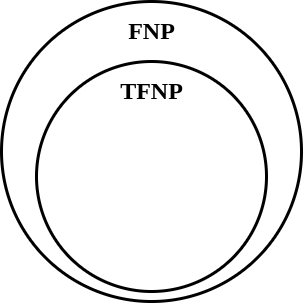
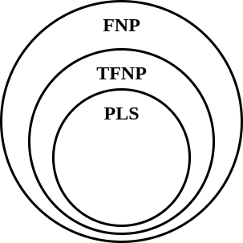

Congestion Games
================

Richiamando il [Global Connection Game](./20.html), gli \"ingredienti\"
del problema sono:

-   Un grafo $G(V,E)$ [diretto]{.underline}.
-   Dei costi $c_e$ [non negativi]{.underline} per ogni archo $e \in E$.
-   Un insieme di $k$ player egoistici, dove ad ognuno è associata un
    nodo sorgente $s_i$ e una destinazione $t_i$.
-   Ogni player $i$ deve scegliere come *strategia* un cammino $P_i$ che
    collega $s_i$ a $t_i$.
-   Data una configurazione di strategie $S = (P_1, ..., P_k)$, il costo
    del singolo player $i$ è pari a $$
     COST_i(S) = \sum_{e \in P_i} \frac{ c_e }{ k_e(S) }
     $$ doce $k_e(S)$ sta ad indicare il numero di player che in $S$
    utilizzano l\'arco $e$.

Abbiamo visto che `GCG` è un **gioco potenziale**, e sappiamo che per un
gioco potenziale esiste [sempre]{.underline} un `NE` e che applicando la
dinamica *better response* si convergerà sempre ad un `NE`.\
Il problema è che nessuno conosce una dinamica di tipo *better response*
che faccia converge ad un equilibrio in tempo **polinomiale**, tantomeno
si sa come calcolare un equilibrio in tempo polinomiale. Perciò ci si
può chiedere se si riesce a dare un\'evidenza formale che il problema
sia effettivamente *computazionalmente difficile*.\
Il **Congestion Game** (`CG`) è una [generalizzazione]{.underline} del
`GCG`. Gli ingredienti del problema sono:

-   Un insieme $E$ di *risorse*.
-   Un insieme di $k$ player egoistici.
-   Ogni player $i$ sceglie una strategia $S_i$ da un suo insieme di
    possibili strategie $\mathcal{S}_i \subseteq 2^E$.
-   Ogni risorsa $e \in E$ ha un [costo possibile]{.underline}
    $c_e(1), c_e(2), ... , c_e(k)$, che dipende dal numero di player che
    la utilizzano. Se una risorsa $e \in E$ è usata da $x$ player,
    allora il suo costo sarà $c_e(x)$.
-   Dato un vettore di strategie
    $S \in \mathcal{S}_1 \times \mathcal{S}_2 \times ... \times \mathcal{S}_k$,
    il costo del player $i$ sarà $$
     COST_i(S) = \sum_{e \in S_i} c_e(k_e(S))
     $$ dove $k_e(S)$ indica il numero di player che utilizzano la
    risorsa $e$ nelle rispettive strategie.

È possibile dimostrare che `CG` è un *gioco potenziale*, con funzione
potenziale $$
  \Phi(S) = \sum_{e \in E} \sum_{i = 0}^{k_e(S)} c_e(i)
  $$

Ciò implica che esiste sempre un `NE` per il `CG` (ogni minimo locale di
$\Phi$), e che la dinamica better response converge sempre a un `NE`.\

FNP class
=========

Per iniziare a capire quanto può essere complesso il *Congestion Game*
il primo passo è quello di definire formalmente un problema. Definiamo
quindi con `CG-NE` il problema del calcolo di un equilibrio di Nash per
il *Congestion Game*.

> **Def:** =CG-NE problem=\
> Data un\'istanza del *Congestion Game*, calcolare un *equilibrio di
> Nash* (a strategie pure).

A questo punto ci possiamo chiedere in quale classe di complessità
collocare il `CG-NE` problem. Sicuramente non possiamo collocare `CG-NE`
[direttamente]{.underline} nella classe `NP`, in quanto `NP` è una
classe di [problemi
decisionali](https://en.wikipedia.org/wiki/Decision_problem), mentre per
`CG-NE` si richiede di **ricercare** una soluzione. Perciò abbiamo
bisogno di definire una *classe di complessità* in cui collocare i
problemi come `CG-NE`.

> **Def:** `FNP class` (`Functional NP`)\
> La classe `FNP` è la classe di problemi che risolvono il seguente tipo
> di compito:\
> data un\'istanza di un problema decisionale $\Pi \in NP$, determinare
> se tale istanza è una `YES-instance`[^1], e in tal caso
> **calcolare/trovare** un `certificato polinomiale`[^2] per data
> istanza, oppure se è una `NO-instance`, e in tal caso restituire la
> stringa `NO`.

I problemi `FNP` sono anche noti come **search problems**, in quanto non
si richiede solamente di stabilire se una data istanza è una
`YES-instace` o una `NO-instace`, ma di *ricercare* (nel caso di
`YSE-instace`) una effettiva soluzione per data istanza.

FNT-completezza di `CG-NE`
--------------------------

Come qualsiasi altra classe di complessità, si può definire il concetto
di **completezza** di un problema rispetto alla classe `FNP`. Perciò
diciamo che un problema $X \in FNP$ è `FNP-completo` se **per ogni**
altro problema $Y \in FNP$ esiste una **riduzione polinomiale** $\chi$
da $Y$ a $X$ tale che **per ogni istanza** $y \in Y$ esiste un
**certificato polinomiale** per $y$ [se e solo se]{.underline} esiste un
certificato polinomiale per l\'istanza $\chi(y) \in X$. In questo caso
diremo che ogni problema $Y$ è **riducibile polinomialmente** ad $X$,
$Y \preccurlyeq_P X$.\
Un altro modo per dire che un problema $Y$ è *riducibile
polinomialmente* ad $X$, è mostrare che la presenza di due *algoritmi
polinomiali* $A_1,A_2$ tali che:

-   per ogni istanza $y \in Y$ l\'algoritmo $A_1$ crea in tempo
    polinomiale nella grandezza di $y$ un\'istanza $A_1(y) \in X$, tale
    che esiste un certificato polinomiale di $y$ se e solo se ne esiste
    uno di $A_1(x)$.
-   per ogni certificato polinomiale $t$ per l\'istanza $A_1(y) \in X$,
    $A_2$ calcola un certificato polinomiale $A_2(t)$ per l\'istanza
    iniziale $y$.

Possiamo quindi vedere la riduzione come un porecco si `pre` e `post`
processing di un\'instanza $y \in Y$.

{style="max-width:650px; width:100%"}

Perciò dato un problema $X$ già noto essere `FNP-completo`, se
riuscissimo a trovare una riduzione polinomiale vero `CG-NE` per
transitività delle riduzioni polinomiali, potremmo dire che anche
`CG-NE` è `FNP-completo`.

> \*THM 1\*\
> `CG-NE` non è `FNP-completo` a meno che `NP = coNP`[^3]. In altri
> termini, se `CG-NE` è `FNP-completo` allora `NP = coNP`.

> **Proof.** Sappiamo che `SAT` è un problem `FNP-completo`, in quanto
> trovare un\'assegnazione di verità che soddisfa una formula di `SAT`
> equivale al decidere se tale istanza è una istanza `YES`. Supponiamo
> che `CG-NE` sia `FNP-completo`, ovvero di avere una [riduzione
> polinomia]{.underline} da `SAT` a `CG-NE`. Quindi esistono:
>
> -   un algoritmo efficiente[^4] $A_1$ che ad ogni *formula* (istanza)
>     $\phi$ di `SAT` associa un\'istanza $A_1(\phi)$ di `CG-NE`.
> -   un algoritmo efficiente[^5] $A_2$ che ad ogni equilibrio di Nash
>     $S$ per $A_1(\phi)$ associa un\'*assegnazione di verità* $A_2(S)$
>     per la formula $\phi$ se soddisfacibile, altrimenti ritorna `NO`.
>
> Consideriamo quindi una formula $\phi \in SAT$ **non soddisfacibile**.
> Computiamo quindi in tempo polinomiale l\'istanza
> $A_1(\phi) \in CG-NE$. Certamente esiste un equilibrio $S$ per
> $A_1(\phi)$, in quanto `CG-NE` è un gioco potenziale. Dato che per
> ipotesi $\phi$ è non soddisfacibile, allora $A_2(S)$ ritornerà `NO` in
> tempo polinomiale. Così facendo avremmo dimostrato che in tempo
> polinomiale si può trovare un certificato anche per le `NO-instace` di
> `SAT`, ovvero evremmo dimostrate che `NP = coNP` $\square$.

TFNP - Total FNP
----------------

Nel teorema precedente viene sostanzialmente sfruttato il fatto che
un\'isatnza di `CG-NE` ha [sempre]{.underline} un equilibrio di Nash
$S$, perciò in qualche modo possiamo dire che tutte le istanze di
`CG-NE` sono `YES-instance`. Definiamo quindi una classe più specifica
nella quale collocare `CG-NE`.

> **Def:** `TFNP class` (`Total FNP`)\
> La classe `TFNP` è la clesse di tutti quei problemi `FNP` per la quale
> esiste sempre almeno una `YES-instace`.

Per prima cosa possiamo osservare che per definizone
$TFNP \subseteq FNP$.\

{style="max-width:300px; width:100%"}

Osserviamo inoltre che otteniamo il risultato del **Teorema 1**
[solamente]{.underline} grazie al fatto che `CG-NE` è un problema
`TFNP`. In poche parole, se riapplichiamo il **Teorema 1** su un
qualsiasi problema `TFNP` otterremo che

> \*THM 2\*\
> Se un problema `TFNP` è `FNP-completo` allora `NP = coNP`.

### Esmpi di problemi TFNP

Secondo il teorema di Nash sappiamo che ogni gioco finito ammette sempre
un Equilibrio a **strategie miste**. Perciò il problema di
[trovare]{.underline} un equilibrio a strategie miste per un gioco
finito è un problema `TFNP`.\
Un altro problema `TFNP` è il problema **Factoring**[^6], in quanto
grazie al [Teorema fondamentale
dell\'aritmetica](https://it.wikipedia.org/wiki/Teorema_fondamentale_dell%27aritmetica)
sappiamo che ogni numero può essere scomposto nel prodotto di un\'unica
sequenza di numeri primi.

### TFNP-completeness?

Dato che abbiamo visto che non possiamo dimostrare che `CG-NE` è
`FNP-completo` (a meno che `NP = coNP`) potremmo voler dimostrare che
`CG-NE` è `TFNP-completo`.\
Purtroppo però non si conoscono ad ora problemi `TFNP-completi`. Si
pensa che il motivo per il quale non si possono trovare problemi
`TFNP-completi` completi è perché `TFNP` è una classe **semantica** e
non una classe **sintattica**. Le differenze tra le due tipologie di
calssi sono:

Classi Sintattiche
:   Le classi sintattiche sono caratterizzare dal fatto che esiste un
    modello di calcolo che permette di stabilire se un dato problema
    appartiene o meno alla classe in questione.

Classi Semantiche
:   Nelle classi semantiche invece l\'appartenenza o meno di un proble
    alla classe in questione non dipende tanto dal modello di calcolo
    che la definisce, quanto a fattori esterni. Per esempio,
    l\'appartenenza di `CG-NE` in `TFNP` dipende dal fatto che la toeria
    dei giochi ci dice che in un gioco potenziale esiste sempre un
    equilibrio di Nash a strategie pure. Stessa cosa per `factoring`, il
    teorema fondamentale dell\'aritmetica ci garantisce che ogni numero
    o è primo, oppure può essere scomposto in numeri primi.

PLS
---

Abbiamo visto che `CG-NE` non può essere ne `FNP-completo` (a meno che
`NP = coNP`) ne `TFNP-completo` (perché classe semantica). Perciò
vogliamo sapere in quale classe di complessità poter collocare `CG-NE`
per la quale esso è un problema *completo* (o difficile).\
Tale classe è la classe `PLS`, ovvero `Polinomial Local Search`.

> **Def:** `PLS class` (`Polinomial Local Search`)\
> La classe `PLS` è la classe di problemi di ricerca di **ottimi
> locali** tramite un algoritmo polinomiale [ricerca
> locale](https://en.wikipedia.org/wiki/Local_search_(optimization)).

Per algoritmo [polinomiale]{.underline} di ricerca locale si intende un
algoritmo che:

1.  calcoli in tempo polinomiale una qualsiasi soluzione ammissibile
    $X$.
2.  data una soluzione ammissibile $X$ in tempo polinomiale riesce a
    calcolarne il valore.
3.  data una soluzione ammissibile $X$ in tempo polinomiale riesce a
    definire se essa è un ottimo locale, oppure se c\'è un\'altra
    soluzione nel vicinato di \$X\$[^7] migliore. Ovvero se in tempo
    polinomiale si può trovare un\'azione **better response**.

Perciò non è necessariamente richiesto che l\'algoritmo di ricerca
locale **converga** in tempo polinomiale ad una soluzione.\
Certamente `CG-NE` è un problema in `PLS`, in qunato tutti gli equilibri
$S$ sono ottimi locali della funzione potenziale $\Phi$, e sappiamo che
tramite la dinamica better response (ovvero una ricerca locale) si
riesce sempre a trovare un equilibrio.\
Infatti, ritornando ai 3 punti di come deve essere un algoritmo
polinomiale di ricerca locale per `CG-NE` avremo che:

1.  scelgo un qualsiasi progilo di strategie valido $S$ in tempo
    polinomiale.
2.  con un doppio ciclo $\texttt{for}$ riesco a calcolare $\Phi(S)$.
3.  in tempo polinomiale cerco un palyer che ha la possibilità di fare
    una mossa **better respose**.

È anche facile constatare che $PLS \subseteq TFNP$. Infatti certamente
un problema in `PLS` è un problema di ricerca di una soluzione (perciò
$PLS \subseteq FNP$), inoltre se staimo dicendo di voler ricercare gli
ottimi locali (e non se esistono) vuol dire che stiamo dando per
scontato che esiste sempre almeno una soluzione (prciò
$PLS \subseteq TFNP$).

{style="max-width:300px; width:100%"}

PLS-reduction
-------------

Prima di parlare della completezza dei problemi in `PLS` è doveroso
definire cosa è una riduzione tra problemi di ricerca locale. La
definizione è del tutto analoga alle altre classi. Perciò una riduzione
da un problema $Y \in PLS$ ad un altro $X \in PLS$ è una coppia di
algoritmi $A_1, A_2$ tali che:

1.  Per ogni istanza $y \in Y$ l\'algoritmo $A_1$ crea in tempo
    polinomiale un\'istanza $A_1(y) \in X$.
2.  Per ogni ottimo locale di un\'istanza $x \in X$, l\'algoritmo $A_2$
    calcola in tempo polinomiale un ottimo locale per $y$.

Ovviamente se esiste un algoritmo di ricerca locale per $X$ che converge
in tempo polinomiale, allora possiamo risolvere anche $Y$ in tempo
polinomiale.

PLS-completeness
----------------

Abbiamo quindi dato una classe sintattica che contiene `CG-NE`. È
possibile dimostrare che `CG-NE` è `PLS-completo`.\
Per prima cosa però bisogna identificare un problema `PLS-completo`, per
poi mostrarne una riduzione verso `CG-NE`.

### Maximum Cut Problem

Gli ingredienti del `Maximum Cut Problem` sono:

Input
:   Un grafo non diretto e pesato con pesi non negativi
    $G = (V, E, w: E \rightarrow \mathbb{R}^+)$.

Soluzione Ammissibile
:   Un taglio $(X, V \setminus X) \subseteq E$.

Misura da ottimizzare
:   Si vuole trovare una soluzione ammissibile di dimensione massima,
    ovvero si vuole massimizzare il seguente valore $$
     \sum_{(u,v) \in (X, V \setminus X)} w(u,v)
     $$

{style="max-width:300px; width:100%"}

È già noto che tale problema è `NP-hard`. Possiamo però applicare
un\'euristica di **ricerca locale** per trovare un taglio
**massimale**[^8], ovvero un **massimo locale**. Tale ricerca funziona
nel seguente modo:

1.  Considero un qualsiasi taglio $(X, \overline{X})$.
2.  Se spostando un solo vertice da un lato del taglio all\'altro
    ottengo una soluzione migliore, allora faccio questa mossa.
3.  Quando non riesco più a trovare una mossa da fare che milgiori il
    valore della mia soluzione, termino l\'algoritmo. Il taglio finale
    sarà un taglio di valore massimale.

Ovviamente non è sempre detto che un massimo locale equivalga a un
massimo globale, come si può vedere nella seguente immagine.

{style="max-width:500px; width:100%"}

Ci si chiede ora

> Trovare un ottimo locale è \"*più semplice*\" che trovare un ottimo
> globale? Ovvero, la ricerca locale precedentemente descritta converge
> in tempo polinomiale o in tempo esponenziale?

Nel caso particolare di grafi non pesati (ovvero quando tutti i pesi
valgono 1) si può dimostrare la ricerca locale converge a un ottimo
locale in tempo polinomaile. Infatti ad ogni mossa la soluzione migliora
di almeno un arco, e dato che ci sono al più $n^2$ archi, in al più
$n^2$ mosse si convergerà ad un ottimo locale. Il problema di trovare un
ottimo globale invece, rimane sempre `NP-hard` anche nel caso
particolare di grafi non pesati.\
Purtroppo però nel caso generale con pesi generici non negativi anche
trovare un ottimo locale è `NP-hard`. Ovvero l\'euristica precedente,
nel caso generale, non converge in tempo polinomiale ad un massimo
locale.\
Ricapitolando:

-   non si conosce un algoritmo polinomiale per calcolare un massimo
    **globale** di `Max Cut`.
-   non si conosce un algoritmo polinomiale per calcolare un massimo
    **locale** di `Max Cut`.

> **Theorem** /(Johnson, Papadimitriou, Yannakakis '85, Schaffer,
> Yannakakis 91)/\
> Computing a local maximum of a maximum cut instance with general
> non-negative edge weights is a PLS-complete problem.

Questo teorema ci dice che tutti i problemi in `PLS` sono riducibili a
`Max Cut`, se se conoscessimo un algoritmo (qualsiasi, non
necessariamente di ricerca locale) per risolvere `Max Cut` in tempo
polinomiale alora saremmo in grado di risolvere in tempo polinomiale
**tutti** i problemi in `PLS`.\
Esiste un corollario di questo teorema che dice anche che se volessimo
usare un qualsiasi algoritmo di ricerca locale, si convergerebbe ad una
soluzione in tempo esponenziale, indipendentemente dalle scelte fatte
per spostarsi durante la ricerca.

> **Corollary** /(Johnson, Papadimitriou, Yannakakis, '85, Schaffer,
> Yannakakis 91)/\
> Computing a local maximum of a maximum cut instance with general
> non-negative edge weights using local search can require an
> exponential (in $\vert V \vert$) number of iterations, no matter how
> an improving local move is chosen in each iteration.

### Completezza del Congesion Game

> **Theorem** /(Fabrikant, Papadimitriou, Talwar 2004)/\
> `CG-NE` is `PLS-complete`.

> **Proof:** verrà proposta una riduazione dal problema del
> `Local Max Cut` a `CG-NE` $$
> \texttt{Local Max Cut} \preccurlyeq_P \texttt{CG-NE}
> $$
>
> Data un\'istanza $G=(V,E,w)$ di `Local Max Cut` costruiamo un\'istanza
> di `CG-NE`.
>
> -   Per ogni nodo $v \in V$ definiamo il player.
>
> -   Per ogni arco $e \in E$ definiamo due risorse $r_e$ ed
>     $\overline{r}_e$.
>
> -   Ogni player $v$ ha solamente due possibili strategie
>
>     \\begin{align\*}
>
> S~v~ &= { r~e~ : e ∈ δ(v) }\
> `\overline{S}`{=latex}~v~ &= { `\overline{r}`{=latex}~e~ : e ∈ δ(v) }
> \\end{align\*} ovvero $v$ può decidere solamente se comprare tutte le
> risorse $r_e$ oppure tutte quelle $\overline{r}_e$ per tutti i soui
> archi incidenti.
>
> -   per ogni risorsa $r \in \lbrace r_e, \overline{r}_e \rbrace$ il
>     suo costo sarà \\\[ c~r~(i) = \\begin{cases}
>
> 0 &se  i = 0,1\
> w(e) &se  i = 2 \\end{cases} \\\] ovvero se due nodi utilizzano una
> stessa risorsa allora il suo costo sarà pari al peso del rispettivo
> arco, 0 altrimenti.
>
> Osserviamo che per ogni possible taglio $(X, \overline{X})$ esiste un
> relativo profilo di strategie $S$, e [viceversa]{.underline}. Infatti,
> dato un taglio $(X, \overline{X})$ possiamo dire per ogni nodo
> $v \in X$ il rispettivo player ha scelto la strategie $S_v$, mentre
> per ogni nodo $v \in \overline{X}$ il rispettivo player ha scelto la
> strategia $\overline{S}_v$.\
> Viceversa dato un profilo di strategie $S$, indichiamo il taglio
> $(X_S, \overline{X}_S)$ dove in $X_S$ ci sono tutti player che hanno
> scelto la strategie $S_v$, mentre in $\overline{X}_S$ ci sono tutti
> quei nodi che hanno scelto $\overline{S}_v$.\
> Infatti dato un profilo distrategie $S$ avremo che
>
> ```{=latex}
> \begin{align*}
>   \Phi(S)
>   &= \sum_{r \in R} \sum_{i = 0}^{k_r(S)} c_r(i)\\
>   &= \cdots = W(E) - W(X_s, \overline{X}_S)
> \end{align*}
> ```
> Dove $W(\cdot)$ indica la somma dei pesi degli archi.\
> Perciò osserviamo che al cresce del valore del taglio
> $(X,\overline{X})$, la funzione potenziale del rispettivo equilibrio
> $S$ decresce. Perciò a un massimo locale per `Local Max Cut`
> corrisponde un minimo $\Phi(S)$, e viceversa $\square$.

------------------------------------------------------------------------

Complexity of Mixed Nash Equilibria
===================================

Abbiamo appena collocato un problema che riguarda la ricerca di un
equilibrio a [strategie pure]{.underline} come `PLS-completo`. In
generale però non è detto che in ogni tipo di gioco esista un equilibrio
a strategie pure, per il momento ne abbiamo la certezza solamente per i
giochi potenziali. Viceversa per gli equilibiri a **strategie miste**,
sappiamo grazie al Teorema di Nash che esiste sempre un equilibrio per
qualsiasi gioco finito. Perciò per esempio ci si potrebbe chiedere dove
poter catalogare un problema di ricerca di equilibri a strategie miste.\
Per esempio consideriamo il gioco [Bitmatrix
Game](https://en.wikipedia.org/wiki/Bimatrix_game) con soli **due
players** (senza perdita di tempo non entriamo nel dettaglio della
descrizione). Definiamo ora il problema `MNE`

> **Def:** `MNE problem=\\
> Dato un'istanza di un qualsiasi gioco finito a due player (per esempio =Bitmatrix`),
> trovare un equilibrio a **strategie miste**.

Sappiamo già che esiste una soluzione, perciò possiamo catalogare questo
problema in `TFNP` $$
  \texttt{MNE} \in \texttt{TFNP}
  $$ e inoltre non si conosce nessun algoritmo polinomiale che risolva
tale problema.\
Dato che sappiamo che probabilmente non esistono problemi
`TFNP-completi` ci chiedhimo: dove catalocare più precisamente `MNE`?

PPAD
----

Intuitivamente possiamo visualizzare la classe `PLS` come quella classi
di problemi per i quali esiste un **DAG**[^9] dove i nodi rappresentano
delle soluzioni possibili mentre un arco diretto rappresenta un
**improving local move**[^10].

{style="max-width:300px; width:100%"}

Possiamo quindi pensare ai nodi pozzo di questo DAG come gli ottimi
locali del problema.\
Esiste invece una classe equivalente per il problema di ricerca di
equilibri a strategie miste, nota come `PPAD`. Tale classe è simile
intuitivamente alla classe `PLS`, ovvero si effettua una ricerca locale
per non su di un DAG, bensì su un grafo diretto di **in-** e **out-**
degree pari esattamente 1. Perciò i tipi di grafi in questione sono o
delle liste o degli anelli.

{style="max-width:300px; width:100%"}

In questo caso però le soluzioni non sono solamente i nodi pozzo, ma
anche i nodi sorgente.\
In teoria il termine `PPAD` sta per *Polynomial Parity Argument in a
Directed graph*, ma in realtà la leggenda vuole che il nome di questa
classe è dato dalla somiglianza col nome di chi ha definito questa
classe, [Christos H.
Papadimitriou](https://en.wikipedia.org/wiki/Christos_Papadimitriou).\

> **Theorem** /(Daskalakis, Godberg, Papadimitriou 06, Chen,Deng,Teng
> 06)/\
> Computing any `MNE` of a bimatrix game is `PPAD-complete`.

{style="max-width:300px; width:100%"}

------------------------------------------------------------------------

[^1]: istanze di un problme in `NP` che ammettono l\'esistenza di un
    certificato verificabile in tempo polinomiale nella grandezza
    dell\'istanza.

[^2]: un certificato verificabile in tempo polinomiale ha certamente una
    [dimensione polinomiale]{.underline}, in quanto per essere
    verificato va innanzitutto letto.

[^3]: la classe di tutti i problemi per i quali è possibile identificare
    un *certificato polinomiale* per le `NO-instance`.

[^4]: calcolabile in tempo polinomiale.

[^5]: calcolabile in tempo polinomiale.

[^6]: scomposizione in numeri primi.

[^7]: per vicinato di una soluzione $X$ si intende l\'insieme di tutte
    quelle soluzioni ammissibili $Y$ tali che si può passare da $X$ ad
    $Y$ facendo una sola mossa/modifica.

[^8]: un taglio è detto massimale se, spostando un qualsiasi nodo da un
    lato del taglio all\'altro il nuovo taglio non è migliore del
    precedente.

[^9]: Directed Acyclic Graph.

[^10]: un movimento better response durante la ricerca locale.
